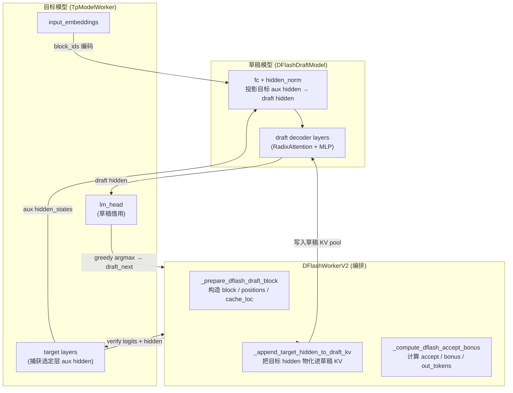
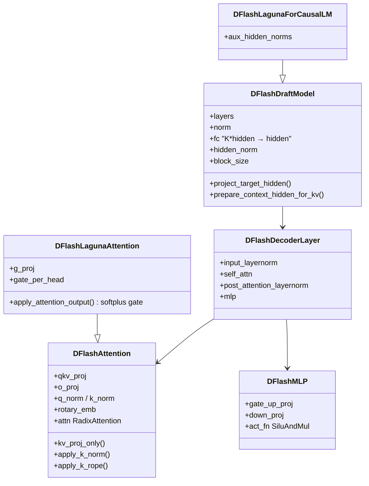
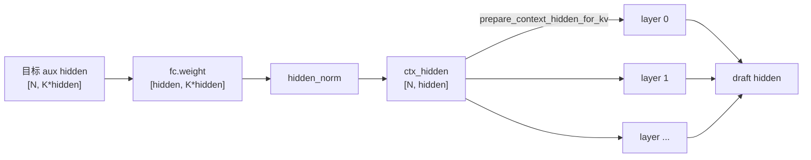
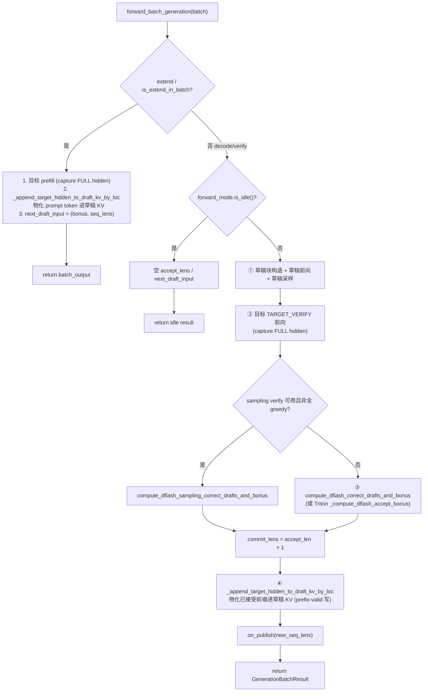
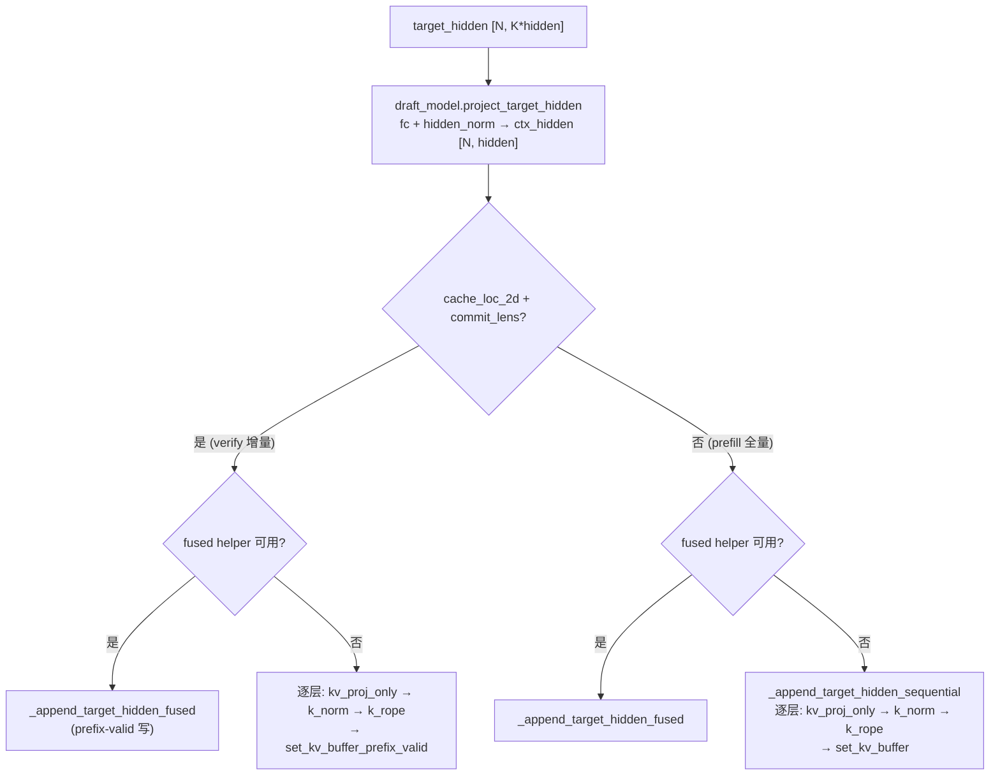
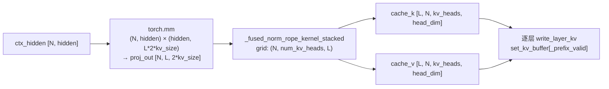
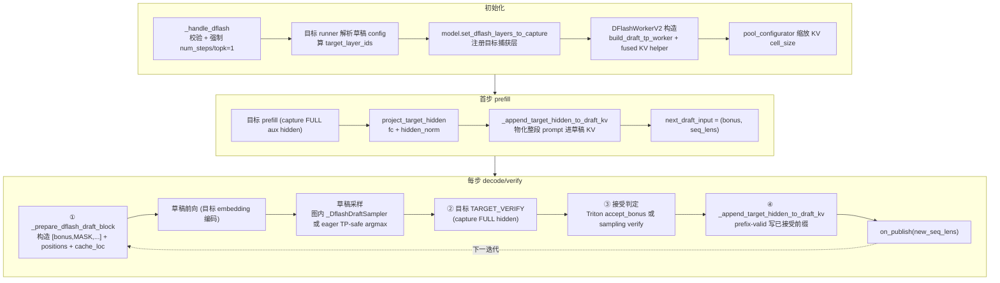

# SGLang DFlash 投机解码实现逻辑梳理

> 本文基于 SGLang 当前主干代码，梳理 **DFlash** 投机解码算法的设计动机、模型结构、调度与执行链路、KV 物化机制及关键配置。所有结论均标注 `文件:行号`，便于对照源码。

---

## 1. 设计动机

DFlash 是一种 **block-draft-with-target-KV**（块级草稿 + 目标 KV 复用）的投机解码算法。与 EAGLE 系列同属「自回归草稿 + 目标校验」范式，但在两点上做了关键简化：

- **草稿模型没有自己的 embedding 与 lm_head**。草稿模型直接借用目标模型的 input embedding 把 token 编码为 hidden，并用目标模型的 `lm_head` 对草稿 hidden 做 greedy argmax 生成候选 token（`python/sglang/srt/models/dflash.py:1-4` 文件头注释）。
- **草稿模型的 KV cache 由目标模型的隐状态物化（materialize）而来**，而非由草稿模型自身对「自己产出的 token」做 attention 累积。目标模型在校验时按选定的若干层捕获 aux hidden states，拼接后投影到草稿 hidden_size，再走 KV 投影写入草稿 KV pool。

由此带来的收益与代价：

| 方面 | 说明 |
|------|------|
| 草稿模型体积 | 无 embedding / lm_head 权重，参数量更小 |
| 草稿生成质量 | 直接用目标 lm_head 取 argmax，候选与目标分布更对齐 |
| KV 一致性 | 草稿 KV 由目标隐状态派生，与目标「看到同样 token」的语义一致 |
| 代价 | 每步需把目标 hidden 物化进草稿 KV（prefill 全量、verify 增量），有额外 kernel 开销 |
| 线性校验 | 候选是线性序列（topk==1），不做树形校验 |

算法注册（`python/sglang/srt/speculative/spec_info.py:36`）：

```python
class SpeculativeAlgorithm(IntEnum):
    ...
    DFLASH = auto()
    DSPARK = auto()   # DFlash 的 Markov-head 变体，复用同一草稿架构
```

`is_dflash_family()` = DFLASH 或 DSPARK（`spec_info.py:117-118`）。DSPARK 复用 `models/dflash.py` 的 `DFlashDraftModel`（`python/sglang/srt/models/dspark.py:11` 直接 import），仅在头部换成一个 Markov 预测头。本文聚焦 DFLASH 本身。

---

## 2. 整体架构



核心循环（decode 阶段，每步）：

1. **构造草稿块**：`[bonus_token, MASK, MASK, …, MASK]`（长度 `block_size`），positions = `prefix_len … prefix_len+block_size-1`，cache_loc 从 `req_to_token` 表 gather。
2. **草稿前向**：用目标 embedding 编码 block_ids → 草稿 layers → draft hidden。
3. **草稿采样**：用目标 `lm_head` 对 draft hidden（位置 1 之后）做 greedy argmax → `draft_next`（`block_size-1` 个候选）。
4. **目标校验**：把 `draft_tokens`（bonus + 候选）送目标模型 `TARGET_VERIFY` 前向，得到每位置 logits 与 hidden。
5. **接受判定**：greedy 规则算 `accept_len` / `commit_len` / `bonus` / `out_tokens`。
6. **KV 物化**：把目标 verify 的 hidden 中「已接受前缀」物化进草稿 KV（`commit_lens` 控制每条请求写多少行）。

---

## 3. 草稿模型结构（`models/dflash.py`）

### 3.1 类层次



`EntryClass = [DFlashDraftModel, DFlashLagunaForCausalLM]`（`dflash.py:579`）。

### 3.2 注意力层 `DFlashAttention`（`dflash.py:71-236`）

- **标准 Qwen3 式结构**：`QKVParallelLinear` + per-head `q_norm`/`k_norm` RMSNorm + RoPE + `RadixAttention` + `o_proj`。
- **层类型分流**（`_get_dflash_layer_attention_params`，`dflash.py:46-68`）：读 config 的 `layer_types`，`full_attention` → `AttentionType.ENCODER_ONLY`（无 sliding window），`sliding_attention` → `AttentionType.DECODER` + sliding window（window 大小 = `config.sliding_window - 1`，因 HF 窗口含当前 token 而 SGLang 存 `window_left`，见 `dflash_utils.py:310-325`）。
- **KV 物化专用方法**（草稿 KV 不经完整 attention，只算 K/V）：
  - `kv_proj_only(hidden)`（`dflash.py:202-225`）：只投影 K/V，跳过 Q。快速路径：当权重未量化时（`can_dflash_slice_qkv_weight`），直接从融合 QKV 权重切片 `[q_size : q_size+2*kv_size]` 做一次 GEMM；退化路径：算完整 QKV 再丢弃 Q（兼容量化权重）。
  - `apply_k_norm(k)`（`dflash.py:227-230`）：per-head RMSNorm(K)。
  - `apply_k_rope(positions, k)`（`dflash.py:232-236`）：对 K 单独上 RoPE（造一个同形 dummy_q 让 kernel 通过 head-count 检查）。

### 3.3 草稿模型主体 `DFlashDraftModel`（`dflash.py:322-427`）



- **`fc` + `hidden_norm`**（`dflash.py:366-370`）：把 K 个目标层的 aux hidden 拼接（`num_context_features * hidden_size`）投影回 `hidden_size`。K = `len(target_layer_ids)`，由草稿 config 解析（见 §4.2）。
- **`project_target_hidden(target_hidden)`**（`dflash.py:382-394`）：`hidden_norm(fc(target_hidden))`，并校验特征维匹配（不匹配报清晰错误，提示「目标捕获的层数与草稿 checkpoint 期望不符」）。
- **`prepare_context_hidden_for_kv(layer, ctx_hidden)`**（`dflash.py:377-380`）：基类返回 `ctx_hidden`（identity）；Laguna 变体返回 `layer.input_layernorm(ctx_hidden)`（见 §3.5）。
- **`forward`**（`dflash.py:396-427`）：要求传入 `input_embeds`（用目标 embedding），跑所有层，最终 norm，返回 `LogitsProcessorOutput(hidden_states=...)`（无 logits，因为草稿无 head）。
- **`supports_fused_context_kv = True`**（`dflash.py:332`）：标记可走融合 KV 物化路径（见 §6.2）。

### 3.4 权重加载（`dflash.py:429-483`）

stacked 映射：`q_proj/k_proj/v_proj → qkv_proj`，`gate_proj/up_proj → gate_up_proj`。`resolve_param_name` 兼容带/不带 `model.` 前缀的权重名。对 `fc.weight` 做形状校验——若 checkpoint 的 K 与 config 不符会在此报错（`dflash.py:472-481`）。

### 3.5 Laguna 变体（`dflash.py:486-577`）

`DFlashLagunaAttention` 增加一个训练好的 **softplus gate**（`g_proj` → `softplus` → 逐 head 或逐元素乘 attn_output）。`DFlashLagunaForCausalLM` 设 `supports_fused_context_kv = False`（每个 context feature 需单独走 `aux_hidden_norms` 归一化，`project_target_hidden` 重写为切片逐个 norm 再拼接，`dflash.py:556-576`），故走顺序 KV 物化路径。

---

## 4. 配置解析与目标层选择（`dflash_utils.py`）

### 4.1 草稿 config（`parse_dflash_draft_config`，`dflash_utils.py:439-520`）

从草稿 HF config 的 `dflash_config` 字典（或顶层字段）解析出不可变 `DFlashDraftConfig`（`frozen=True` dataclass，`dflash_utils.py:387-436`）：

| 字段 | 来源 | 含义 |
|------|------|------|
| `num_hidden_layers` | draft text config | 草稿层数（必填） |
| `num_target_layers` | `dflash_config` / 顶层 | 训练时目标层数（仅用于校验/回退） |
| `block_size` | `dflash_config` / 顶层 | 校验窗口长度 |
| `target_layer_ids` | `dflash_config` / 顶层 | 显式指定的目标捕获层；缺省则按公式选 |
| `mask_token` | `dflash_config`，默认 `<|MASK|>` | 草稿块占位符 |
| `mask_token_id` | `dflash_config`，可选 | mask token 的 vocab id |

### 4.2 目标层选择（`build_target_layer_ids`，`dflash_utils.py:258-295`）

当 `target_layer_ids` 未显式给出时，按等距采样选 `num_draft_layers` 个目标层（`dflash_utils.py:283-295`）：

```python
start = 1
end = num_target_layers - 3        # 跳过首尾各几层
span = end - start
[layer_ids] = [round(start + i * span / (num_draft_layers - 1)) for i in range(num_draft_layers)]
```

要求 `num_target_layers >= 4`。注意：DFlash 用「选定层之后」的 hidden（HF 风格），而 SGLang 捕获点是「层 i 之前」，故模型 hook 通常 +1 映射（`dflash_utils.py:268-271` 注释）。

### 4.3 KV 显存预算缩放（`scale_kv_cell_size_per_token_for_dflash`，`dflash_utils.py:58-96`）

DFlash 跑独立 draft runner 有自己的 KV pool，目标 runner 的 token 容量需容纳两者之和。按层数线性放大目标 per-token 字节：

```
scaled = target_cell_size * (target_layers + draft_layers + target_layers - 1) // target_layers
```

由 `pool_configurator.py:157-169` 在目标 runner（非 draft worker）上调用。

---

## 5. 编排器 `DFlashWorkerV2`（`dflash_worker_v2.py`）

`DFlashWorkerV2(BaseSpecWorker)`（`dflash_worker_v2.py:99`）同时驱动 overlap 与 non-overlap 调度（overlap 关闭时由 scheduler 同步调用，同 EAGLE，见 `spec_info.py:232-237`）。`__getattr__` 把未实现的方法委托给 target worker（`dflash_worker_v2.py:476-482`）。

### 5.1 主入口 `forward_batch_generation`（`dflash_worker_v2.py:1230-1699`）



#### Prefill 路径（`dflash_worker_v2.py:1241-1297`）

1. 设 `capture_hidden_mode = FULL`，跑目标 prefill，拿到 prompt 的 aux hidden。
2. 用 `extend_lens` / `prefix_lens` / `out_cache_loc` 算 positions，调 `_append_target_hidden_to_draft_kv_by_loc` 把整段 prompt 物化进草稿 KV。
3. **立即物化**是 radix cache 安全所必需的——scheduler 可能在 prefill 返回后更新 radix（`dflash_worker_v2.py:1266-1268` 注释）。
4. 清空 `logits_output.hidden_states`（避免 overlap 调度把大 hidden 拷到 CPU，`dflash_worker_v2.py:1291`）。

#### Decode/Verify 路径

**① 草稿块构造**（`dflash_worker_v2.py:1355-1419`）：优先走 Triton `_prepare_dflash_draft_block_unchecked`（一次 kernel 算出 `block_ids` / `positions_2d` / `cache_loc_2d`）；失败则回退 eager 路径（`assign_extend_cache_locs_func`）。

**①' 草稿前向 + 采样**（`dflash_worker_v2.py:1415-1513`）：
- `embed_module(block_ids)` 得 `input_embeds`。
- `draft_model_runner.forward(forward_batch)` 得 draft hidden。
- 采样分两条路：
  - **图内折叠**（`dflash_worker_v2.py:1495-1498`）：若 `_draft_sampler` 已构建且 `can_run_graph`，直接读 `_draft_sampler.out`（见 §5.3）。
  - **eager TP-safe**（`dflash_worker_v2.py:1500-1509`）：`_greedy_sample_from_vocab_parallel_head`，对大词表分 chunk、TP>1 时 all_gather 各 rank 的 max 再选全局 max（见 §5.4）。
- `draft_tokens[:, 0] = block_ids[:, 0]`（bonus），`draft_tokens[:, 1:] = draft_next`。

**② 目标校验**（`dflash_worker_v2.py:1519-1558`）：构造 `DFlashVerifyInput`，`prepare_for_verify` 打包 `ForwardBatch`（`ForwardMode.TARGET_VERIFY`），调 `target_worker.forward_batch_generation(..., is_verify=True, skip_attn_backend_init=True)`。校验用标准因果 mask（`custom_mask=None`，`dflash_worker_v2.py:1516-1517`）。

**③ 接受判定**（`dflash_worker_v2.py:1567-1651`）：见 §7。

**④ KV 物化**（`dflash_worker_v2.py:1665-1682`）：把目标 verify 的 hidden（`[bs, block_size, hidden]`）物化进草稿 KV，用 `cache_loc_2d` + `commit_lens` 做 **prefix-valid 写**（只写每条请求已接受的前缀行，未接受位置不写，见 §6.1）。

### 5.2 KV 物化 `_append_target_hidden_to_draft_kv_by_loc`（`dflash_worker_v2.py:873-1028`）



- **prefix-valid 写**（`cache_loc_2d` + `commit_lens`）：`set_kv_buffer_prefix_valid`（`python/sglang/srt/mem_cache/memory_pool.py:1876`）只写 `commit_lens[i]` 行，避免构造 masked/packed 索引张量（`dflash_worker_v2.py:959-1006`）。
- **fused 失败回退**：任何 fused 路径抛异常都会永久关闭 fused（`self._use_fused_kv_materialize = False`），回退到顺序路径，保证正确性（`dflash_worker_v2.py:978-984, 1016-1022`）。

### 5.3 图内草稿采样器 `_DflashDraftSampler`（`dflash_worker_v2.py:65-96, 316-351`）

把「草稿 hidden → 目标 lm_head → argmax」折叠进草稿 cuda graph，使草稿采样被 capture 并计入 `fwd_occupancy`。

构建条件（`_maybe_build_draft_sampler`，`dflash_worker_v2.py:316-351`）：

- `tp_size == 1`（TP>1 保持 eager）
- `block_size > 1`
- 目标 `lm_head` 存在且权重为浮点（量化 lm_head 会破坏静态 matmul）
- 无 added vocab（`shard_indices.num_added_elements == 0`）

满足时通过 `make_draft_sampler_capture_hook`（`draft_worker_common.py:153-164`）注册为 `draft_model_runner.capture_tail_hooks`，在 graph capture 末尾调用，把 argmax 结果写入 `self.out`。

### 5.4 eager TP-safe 采样 `_greedy_sample_from_vocab_parallel_head`（`dflash_worker_v2.py:661-871`）

大词表无法高效物化完整 logits，且 TP>1 时每个 rank 只持有一片 lm_head 权重。策略：

1. 分 chunk（默认 256，tp=1 无 added vocab 时放大到 1024，`dflash_worker_v2.py:741-756`）做 `matmul(hs, weight.T)`。
2. 每 rank 算 base vocab 片的 `(max, arg)`；若有 added vocab，再算 added 片并合并（`dflash_worker_v2.py:782-795`）。
3. 本地 argmax 转 global id（base 加 `org_vocab_start`，added 加 `added_vocab_start`，`dflash_worker_v2.py:797-809`）。
4. TP>1 时 `all_gather_into_tensor` 收集各 rank 的 max 与 id，再 `argmax` 选最优 rank、`gather` 取对应 id（`dflash_worker_v2.py:816-869`）。

### 5.5 mask token 解析 `_resolve_mask_token_id`（`dflash_worker_v2.py:579-659`）

优先级：显式 `mask_token_id` > tokenizer 的 `mask_token_id` > tokenizer vocab 查表 > **add_special_tokens** 加入 mask token（镜像 HF 参考实现，`dflash_worker_v2.py:628-643`）。任何解析结果若超出目标 vocab_size 都报错——SGLang 暂不支持为目标模型扩展 embedding（`dflash_worker_v2.py:651-657`）。

### 5.6 紧凑草稿 KV（`--speculative-draft-window-size`）

当指定 `draft_window_size` 时（`dflash_worker_v2.py:131-134`）：

- `alloc_memory_pool`（`dflash_worker_v2.py:263-280`）让草稿 worker 维护一份**私有紧凑 req→token 表**，复用同一全局 KV 索引空间——radix/prefix-hit 的 KV 仍可复用，而草稿 attention 只看最近窗口。
- `_compute_compact_draft_seq_lens`（`dflash_worker_v2.py:561-577`）：把 seq_lens clamp 到窗口大小；paged 后端为保证本地 page 结构，窗口起点对齐到 page 边界（最多左侧多留 `page_size-1` token）。
- decode 时从 committed target state 重建草稿本地滑动窗口视图（`dflash_worker_v2.py:1422-1456`）。

### 5.7 Mamba 状态提交（`dflash_worker_v2.py:1103-1147`）

若目标是 Mamba-ish 模型（`model_runner.mambaish_config` 且 attn backend 有 `update_mamba_state_after_mtp_verify`），`TARGET_VERIFY` 期间 Mamba kernel 以 `disable_state_update=True` 跑并缓存每步中间态；接受后按 `commit_lens - 1` 选出每条请求最后接受的步，提交对应 Mamba state（并处理 `mamba_track_interval` 的追踪点）。

---

## 6. Triton kernel

### 6.1 草稿块构造与接受判定（`kernels/ops/speculative/dflash.py`）

**`_prepare_dflash_draft_block_contig_kernel`**（`dflash.py:143-191`）：grid `(batch_size,)`，每行：
- 读 `prefix_len` / `req_idx` / `bonus_token`。
- `logical_pos = prefix_len + cols`，从 `req_to_token[req_idx, logical_pos]` gather 出 `cache_loc`。
- `block_ids`：pos 0 写 bonus，其余写 `mask_token_id`。
- 一次写出 `block_ids_out` / `positions_out` / `cache_loc_out`。

**`_dflash_accept_bonus_contig_kernel`**（`dflash.py:6-60`）：grid `(batch_size,)`，每行做 greedy 接受判定：
- 顺序比较 `candidate[col+1] == target[col]`，遇首个不匹配停止（`prefix_live` 标志位实现短路）。
- 算出 `accept_len`、`commit_len = accept_len + 1`、`bonus = target[accept_len]`、`new_seq_len = prefix + commit_len`。
- `out_tokens`：默认取 `candidate_tail`，在 `accept_len` 位置写 `bonus_id`。

`_pick_num_warps`（`dflash.py:63-70`）按 block_size 选 warps（≤16 用 1，≤32 用 2，…）。两个 kernel 都要求输入行主序连续，否则报错（`dflash.py:91-116, 208-221`）。失败时 worker 回退 eager 路径并永久关闭该 Triton 路径（`dflash_worker_v2.py:1371-1394, 1612-1635`）。

### 6.2 融合 KV 物化（`kernels/ops/speculative/fused_kv_materialize.py`）

`FusedKVMaterializeHelper`（`fused_kv_materialize.py:242-457`）把「逐层 KV 投影 + RMSNorm(K) + RoPE」融合：



- **构造期**（`fused_kv_materialize.py:292-338`）：把每层的 `qkv_proj.weight` 切出 KV 片，stack 成 `[L*2*kv_size, hidden]` 转置连续；stack 所有 `k_norm.weight` 与 eps；预建 RoPE cos/sin cache。
- **物化期**（`materialize`，`fused_kv_materialize.py:389-457`）：一次大 GEMM 投影所有层，再调 `_fused_norm_rope_stacked` Triton kernel 对 K 做 RMSNorm + RoPE（V 原样写），最后逐层调 `write_layer_kv` 写入 pool。

启用门槛（`_init_fused_kv_helper`，`dflash_worker_v2.py:352-443`）：所有层 qkv_proj 未量化且无 bias、`k_scale`/`v_scale` 为 1、RoPE 为 neox 风格、`supports_fused_context_kv=True`。任一不满足则禁用并记日志。

---

## 7. 接受规则与采样校验（`dflash_utils.py`）

### 7.1 greedy 校验 `compute_dflash_correct_drafts_and_bonus`（`dflash_utils.py:547-585`）

```
candidates:  [bs, block_size]   # [:, 0] = bonus, [:, 1:] = 草稿候选
target_predict: [bs, block_size]  # 目标每位置 argmax
matches = candidates[:, 1:] == target_predict[:, :-1]
correct_len = matches.cumprod(dim=1).sum(dim=1)   # 首个不匹配处截断
bonus = target_predict[arange(bs), correct_len]
```

`commit_len = correct_len + 1`（含 bonus，`dflash_worker_v2.py:1581, 1622`）。`out_tokens` 把候选左移、末位置 0、再在 `accept_len` 处 scatter bonus（`dflash_worker_v2.py:1582-1588`）。

### 7.2 采样校验 `compute_dflash_sampling_correct_drafts_and_bonus`（`dflash_utils.py:588-723`）

非全 greedy 时走 `sgl_kernel.tree_speculative_sampling_target_only`（CUDA/MUSA 才可用，`dflash_utils.py:35-51`）。DFlash 提案是线性的（topk==1），故每级至多一个候选；被拒级从 `relu(q - p)`（p 仅含被拒候选质量）采样最终 token。流程：

1. `build_dflash_verify_target_probs`（`dflash_utils.py:726-793`）：对 verify logits 做 temperature 缩放、top-k（稀疏精确路径，避免大词表全 softmax）、top-p renorm，得 `target_probs [bs, block_size, vocab]`。
2. 取/建 chain-verify 缓冲（`_get_or_create_chain_verify_buffers`，`dflash_utils.py:199-255`，按 `(device, draft_token_num)` 缓存并按需 2× 扩容）。
3. 调 `tree_speculative_sampling_target_only`，阈值取自 `--speculative-accept-threshold-single/acc`（`dflash_utils.py:636-645`）。
4. 由 `accept_token_num` 与 `accept_index` 取出 `bonus`。

### 7.3 logits 调整 `apply_dflash_verify_logits_adjustments`（`dflash_utils.py:110-196`）

对目标 verify 的 `next_token_logits`（形状 `[bs*block_size, vocab]`）施加 sampling-time 调整：custom logit processor、`acc_linear_penalties`（overlap 调度的廉价路径，广播到 verify block 而非每步物化 `[bs*block_size, vocab]`）、`logit_bias`、penalizer/vocab_mask 的 dense 回退。

### 7.4 请求级校验 `validate_dflash_request`（`dflash_utils.py:796-814`）

逐请求拒绝：`return_logprob`、overlap 下的 `return_hidden_states`、grammar 约束（json_schema / regex / ebnf / structural_tag）。由 `scheduler.py:2189-2190` 在请求接入时调用。

---

## 8. SpecInput 数据结构

| 类 | 文件 | SpecInputType | 角色 |
|----|------|---------------|------|
| `DFlashDraftInputV2` | `dflash_info_v2.py:40` | `DFLASH_DRAFT` | 跨 overlap 迭代携带草稿侧状态（bonus、seq_lens、reserved 长度等） |
| `DFlashVerifyInput` | `dflash_info.py:23` | `DFLASH_VERIFY` | 一次目标 verify 前向的输入（draft_token、positions、draft_token_num、custom_mask） |

`DFlashDraftInputV2.prepare_for_decode`（`dflash_info_v2.py:119-243`）做 **over-allocation**：为每个 req 预留 `2 * block_size` 的 KV slot 余量（`reserved_len = max(cur_alloc_len, committed_len + 2*block_size)`，`dflash_info_v2.py:160`），使 worker 能直接从 `req_to_token` gather `out_cache_loc` 而无需 allocator backup/restore。CPU 元数据故意落后一迭代，与支撑 over-allocation 的 reserved 上界分开保存（`dflash_info_v2.py:122-127` 注释）。可选 plan stream（`SGLANG_ENABLE_OVERLAP_PLAN_STREAM`）让 prep kernel 与上一批 forward 重叠。

`DFlashVerifyInput.prepare_for_verify`（`dflash_info.py:55-92`）打包 verify `ForwardBatch`，并预初始化 cuda graph replay metadata 或 eager attention metadata，使实际前向能以 `skip_attn_backend_init=True` 跑。`generate_attn_arg_prefill`（`dflash_info.py:94-161`）为 ragged verify 构建 `kv_indices` / `cum_kv_seq_len` / `qo_indptr` / `custom_mask`。

---

## 9. 与调度器 / 目标 runner 的集成

### 9.1 server args 处理（`arg_groups/speculative_hook.py:_handle_dflash`，`speculative_hook.py:147-208`）

启动时强制约束：

- 仅 CUDA（`speculative_hook.py:150-151`）
- 不支持 DP attention（`speculative_hook.py:153-156`）
- `pp_size == 1`（`speculative_hook.py:158-161`）
- 必须给 `--speculative-draft-model-path`（`speculative_hook.py:163-166`）
- 强制 `speculative_num_steps = 1`、`speculative_eagle_topk = 1`（DFLASH 不用 EAGLE 式 num_steps/topk，但这些字段仍影响通用调度/KV 记账，`speculative_hook.py:168-189`）
- `--speculative-dflash-block-size` 与 `--speculative-num-draft-tokens` 必须一致（`speculative_hook.py:191-208`）

### 9.2 目标 runner 配置（`model_runner.py:468-528`）

目标 runner（非 draft worker）解析草稿 config，算出 `target_layer_ids`，并设置三个标志供后续使用：

- `dflash_family_use_aux_hidden_state = True`
- `dflash_family_draft_num_layers`
- `dflash_family_target_layer_ids`

随后（`model_runner.py:1078-1093`）调用 `model.set_dflash_layers_to_capture(target_layer_ids)`（或 DSPARK 的 `set_dspark_layers_to_capture`），把捕获点注册到目标模型。各目标模型（qwen3 / llama / gemma4 / glm4_moe_lite / deepseek_v2 / kimi_k25 / …）都实现了该 hook；若目标模型既无 DSPARK 又无 DFLASH 的 capture setter 则报错。

### 9.3 KV dtype / cuda graph / pool

- **fa4 draft KV dtype 覆盖**（`model_runner.py:2466-2480`）：fa4 draft attention 无法读目标的 fp8 KV（要求 `K.dtype == Q.dtype`），故给 fa4 draft 单独的 compute-dtype KV；fp8-capable 后端保持目标 dtype。
- **prefill cuda graph**（`prefill_cuda_graph_runner.py:182-203`）：DFLASH 需要 aux hidden，prefill graph 一律捕获 `CaptureHiddenMode.FULL`。
- **decode cuda graph**（`decode_cuda_graph_runner.py:515, 543-547`）：DFLASH family 在 decode graph 也开 FULL hidden 捕获，`requested_capture_hidden_mode = max(batch.capture_hidden_mode, spec_info.capture_hidden_mode)`。
- **pool 缩放**（`pool_configurator.py:157-169`）：见 §4.3。

### 9.4 overlap 调度的 `on_publish`（`scheduler.py:3272-3288`）

spec_v2 在 worker 内部（verify 与 draft_extend 之间）触发 `on_publish(new_seq_lens)`，让下一迭代的 schedule prep 与本迭代的 draft_extend 重叠。worker 在 `forward_batch_generation` 中两处调用 `on_publish`（prefill 后 `dflash_worker_v2.py:1252`、decode verify 后 `dflash_worker_v2.py:1663`）。非 overlap 路径由 scheduler 同步驱动，无 future_map relay / on_publish（`scheduler.py:3347-3352`）。

### 9.5 ragged verify（`spec_info.py:374-378`）

DFLASH 支持 ragged verify 布局（每条请求校验长度可变）。`SpecInput.create_for_target_verify` 在 dflash family 下构造带 `ragged_verify_layout` 的 `DFlashVerifyInput`，`generate_attn_arg_prefill` 据此生成变长 `qo_indptr` / `verify_lens`。

---

## 10. 配置项汇总

### 10.1 CLI 参数（`server_args.py`）

| 参数 | 默认 | 说明 |
|------|------|------|
| `--speculative-algorithm DFLASH` | - | 选择 DFLASH 算法 |
| `--speculative-draft-model-path` | 必填 | 草稿模型路径 |
| `--speculative-dflash-block-size` | 自动 | 校验窗口长度（`--speculative-num-draft-tokens` 的别名） |
| `--speculative-draft-window-size` | None | 草稿 KV 滑动窗口大小（紧凑草稿 cache） |
| `--speculative-accept-threshold-single` | 1.0 | 采样校验：单 token 接受阈值 |
| `--speculative-accept-threshold-acc` | 1.0 | 采样校验：累积接受概率提升 |
| `--speculative-draft-attention-backend` | None | 草稿 attention 后端（如 `fa4`、`triton`） |
| `--speculative-attention-mode` | prefill | spec 操作的 attention 模式 |
| `--disable-overlap-schedule` | False | 关闭 overlap，走同步路径 |

### 10.2 草稿 HF config 字段

| 字段 | 位置 | 说明 |
|------|------|------|
| `dflash_config.mask_token` | `dflash_utils.py:490` | 默认 `<|MASK|>` |
| `dflash_config.mask_token_id` | `dflash_utils.py:499` | 可选，显式指定 |
| `dflash_config.block_size` | `dflash_utils.py:460` | 校验窗口长度 |
| `dflash_config.num_target_layers` | `dflash_utils.py:449` | 训练时目标层数（校验用） |
| `dflash_config.target_layer_ids` | `dflash_utils.py:470` | 显式目标捕获层 |
| `num_hidden_layers` | `dflash_utils.py:444` | 草稿层数（必填） |
| `layer_types` | `dflash_utils.py:298` | 每层 `full_attention` / `sliding_attention` |
| `sliding_window` | `dflash_utils.py:316` | sliding 层的窗口大小 |

### 10.3 环境变量

| 变量 | 说明 |
|------|------|
| `SGLANG_ENABLE_OVERLAP_PLAN_STREAM` | 为 overlap 调度的 prep kernel 启用独立 plan stream（`dflash_info_v2.py:24-36`） |
| `SGLANG_ENABLE_STRICT_MEM_CHECK_DURING_BUSY` / `SGLANG_ENABLE_ASYNC_ASSERT` / `SGLANG_ALLOW_OVERWRITE_LONGER_CONTEXT_LEN` | CI 测试中使用的安全断言开关（`test/registered/spec/dflash/test_dflash.py:66-69`） |

---

## 11. 关键文件索引

| 主题 | 文件 | 关键符号 |
|------|------|----------|
| 草稿模型 | `python/sglang/srt/models/dflash.py` | `DFlashDraftModel`, `DFlashAttention.kv_proj_only`, `project_target_hidden` |
| Laguna 变体 | 同上 | `DFlashLagunaForCausalLM`, `DFlashLagunaAttention` |
| 编排器 | `python/sglang/srt/speculative/dflash_worker_v2.py` | `DFlashWorkerV2`, `forward_batch_generation`, `_DflashDraftSampler` |
| 草稿侧 SpecInput | `python/sglang/srt/speculative/dflash_info_v2.py` | `DFlashDraftInputV2`, `prepare_for_decode` |
| 校验侧 SpecInput | `python/sglang/srt/speculative/dflash_info.py` | `DFlashVerifyInput`, `prepare_for_verify` |
| 配置 / 校验 / 采样 | `python/sglang/srt/speculative/dflash_utils.py` | `parse_dflash_draft_config`, `build_target_layer_ids`, `compute_dflash_*`, `validate_dflash_request` |
| 草稿块 / 接受 kernel | `python/sglang/kernels/ops/speculative/dflash.py` | `_prepare_dflash_draft_block_unchecked`, `_compute_dflash_accept_bonus_triton_unchecked` |
| 融合 KV 物化 | `python/sglang/kernels/ops/speculative/fused_kv_materialize.py` | `FusedKVMaterializeHelper`, `_fused_norm_rope_kernel_stacked` |
| 算法注册 | `python/sglang/srt/speculative/spec_info.py` | `SpeculativeAlgorithm.DFLASH`, `is_dflash_family`, `create_worker` |
| server args 处理 | `python/sglang/srt/arg_groups/speculative_hook.py` | `_handle_dflash` |
| 目标 runner 集成 | `python/sglang/srt/model_executor/model_runner.py` | `dflash_family_*` 标志, `set_dflash_layers_to_capture` |
| KV pool 缩放 | `python/sglang/srt/model_executor/pool_configurator.py` | `scale_kv_cell_size_per_token_for_dflash` 调用 |
| cuda graph 捕获 | `python/sglang/srt/model_executor/runner/{prefill,decode}_cuda_graph_runner.py` | `capture_hidden_mode = FULL` |
| 调度器集成 | `python/sglang/srt/managers/scheduler.py` | `validate_dflash_request`, `on_publish` |
| 草稿 worker 构造 | `python/sglang/srt/speculative/draft_worker_common.py` | `build_draft_tp_worker`, `make_draft_input_v2`, `make_draft_sampler_capture_hook` |
| 测试 | `test/registered/spec/dflash/test_dflash.py` | 端到端 GSM8K / matched-stop / radix cache 套件 |

---

## 12. 一图总览



---

### 附：启动配置示例

```bash
# Llama-3.1-8B + DFlash 草稿（CI 默认配置，见 test_utils.py:119-120）
python -m sglang.launch_server \
  --model meta-llama/Llama-3.1-8B-Instruct \
  --speculative-algorithm DFLASH \
  --speculative-draft-model-path z-lab/LLaMA3.1-8B-Instruct-DFlash-UltraChat \
  --trust-remote-code \
  --attention-backend flashinfer \
  --page-size 1

# 启用紧凑草稿 KV 滑动窗口 + fa4 草稿后端
python -m sglang.launch_server \
  --model <target> \
  --speculative-algorithm DFLASH \
  --speculative-draft-model-path <draft> \
  --speculative-draft-window-size 8192 \
  --speculative-draft-attention-backend fa4
```

**已知约束**：仅 CUDA、不支持 DP attention、`pp_size==1`、不支持 `return_logprob`、overlap 下不支持 `return_hidden_states`、不支持 grammar 约束解码（`speculative_hook.py:147-166`、`dflash_utils.py:796-814`）。
