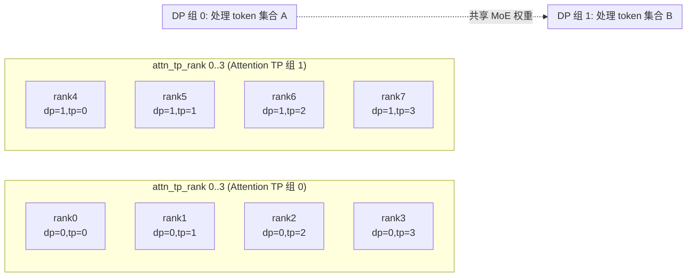
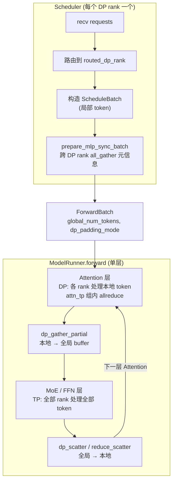
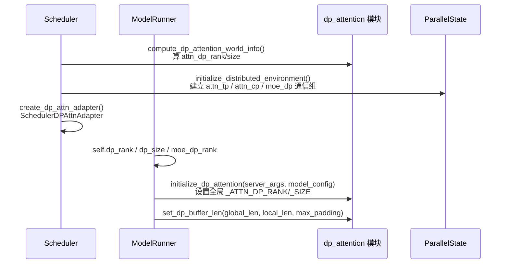
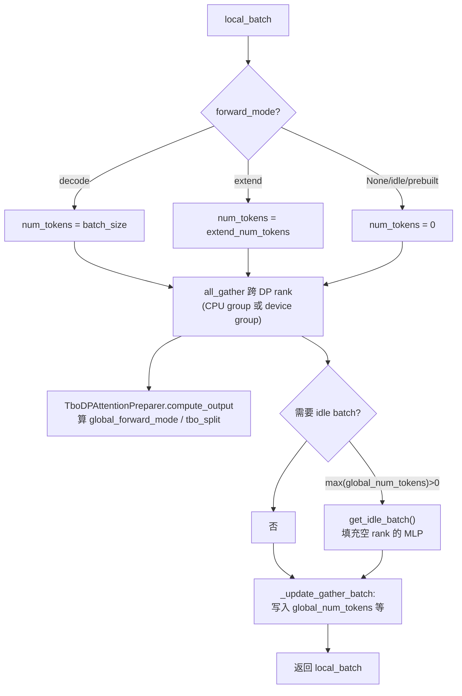
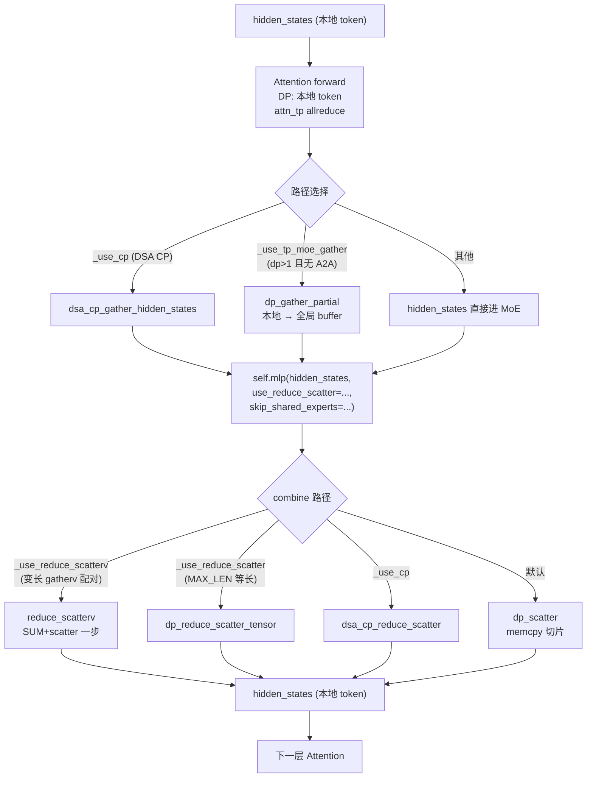
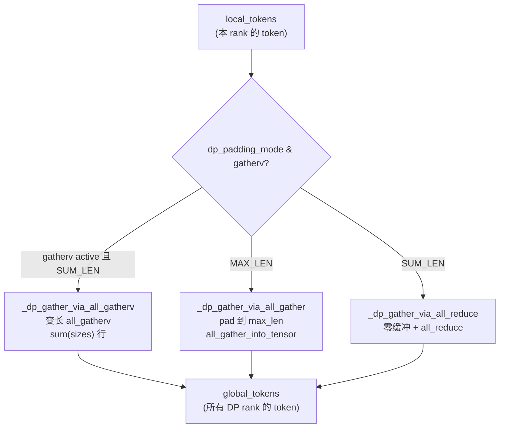
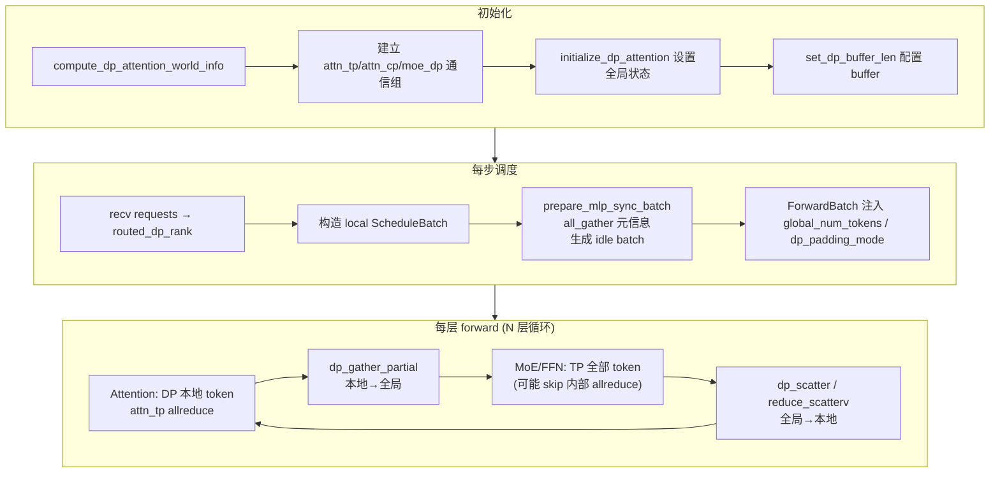

# SGLang DP-Attention 实现逻辑梳理

> 本文基于 SGLang 当前主干代码，梳理 **DP-Attention（Data Parallel Attention）** 的设计动机、并行划分、调度与执行链路、通信原语及关键配置。所有结论均标注 `文件:行号`，便于对照源码。

---

## 1. 设计动机

MoE 模型（DeepSeek-V2/V3/V4、Qwen2/3-MoE 等）的推理存在两类算子：

- **Attention**：每个 token 只访问自己的 KV cache，token 之间在 attention 内部天然独立 → 适合 **数据并行（DP）**。
- **FFN / MoE**：专家权重体积大，按 token 切分开销高 → 适合 **张量并行（TP）**。

传统纯 TP 推理中，所有层都用 `tp_size` 张量并行，attention 层会承受不必要的 TP 通信（allreduce）开销，且每个 TP rank 都要持有完整 KV cache。

**DP-Attention 的核心思想**：把同一组 GPU 在 **Attention 层切分成 DP 组**（各 DP rank 处理不同 token、各自维护 KV cache），在 **FFN/MoE 层合并成 TP 组**（共同处理所有 token）。这样：

- Attention 层消除了 TP allreduce，每个 DP rank 只需 `1/dp_size` 的 KV cache。
- MoE 层仍享受 TP 的显存分摊与算力汇聚。
- 代价：Attention 与 MoE 之间需要 **gather/scatter** 来重组 token。

CLI 开关定义（`python/sglang/srt/server_args.py:946-953`）：

```python
enable_dp_attention: A[
    bool,
    "Enabling data parallelism for attention and tensor parallelism for FFN. "
    "The dp size should be equal to the tp size. "
    "Currently DeepSeek-V2 and Qwen 2/3 MoE models are supported.",
] = False
```

约束（`server_args.py:5310-5327`）：`tp_size % dp_size == 0`；启用后 `schedule_conservativeness *= 0.3`、`chunked_prefill_size //= dp_size`。

---

## 2. 并行维度分解

### 2.1 维度关系

总并行度被分解为四个子维度（`python/sglang/srt/layers/dp_attention.py:245-259`）：

```
tp_size = attn_dp_size × attn_cp_size × attn_tp_size   (+ moe_dense_tp_size 维度)
```

| 维度 | 作用于 | 含义 |
|------|--------|------|
| `attn_dp_size` | Attention | 数据并行：不同 rank 处理不同 token |
| `attn_cp_size` | Attention | 上下文并行（CP）：长序列切分 KV |
| `attn_tp_size` | Attention | 张量并行：QKV/输出投影切分 |
| `tp_size`（整体） | FFN/MoE | MoE 用完整 TP；`moe_dense_tp_size` 可单独缩放 dense FFN |

### 2.2 Rank 排布

排布顺序为 **(dp, cp, tp)**，其中 **tp 是最快变化的维度**：

```
tp_rank = (attn_dp_rank * attn_cp_size + attn_cp_rank) * attn_tp_size + attn_tp_rank
```

由此反解（`dp_attention.py:245-259`）：

```python
attn_dp_size = dp_size if enable_dp_attention else 1
attn_tp_size = tp_size // attn_dp_size // attn_cp_size
attn_tp_rank = tp_rank % attn_tp_size
attn_dp_rank = tp_rank // (attn_tp_size * attn_cp_size)
```

### 2.3 排布示意

以 `tp_size=8, dp_size=2, attn_cp_size=1` 为例（`attn_tp_size=4`）：



- **Attention 阶段**：DP0 处理 token 集合 A，DP1 处理 token 集合 B；组内 4 个 rank 做 TP。
- **MoE 阶段**：8 个 rank 全部参与 TP，共同处理 A∪B。

---

## 3. 整体架构与数据流



核心循环：**Attention（DP）→ gather → MoE（TP）→ scatter → Attention（DP）→ ...**

---

## 4. 初始化流程



关键点：

- **全局单例状态**（`dp_attention.py:43-51`）：`_ATTN_DP_RANK`、`_ATTN_DP_SIZE`、`_ENABLE_DP_ATTENTION_FLAG` 等模块级变量在 `initialize_dp_attention` 中设置，供运行时 `get_attention_dp_rank()` 等查询。
- **ParallelState**（`python/sglang/srt/distributed/parallel_state_wrapper.py:5-23`）冻结了 `attn_tp_rank/size`、`attn_cp_rank/size`、`attn_dp_rank/size`、`moe_dp_rank/size` 等字段，作为各处的权威并行信息来源。
- **KV cache 通信组**（`python/sglang/srt/mem_cache/kv_cache_builder.py:214`）：启用 DP 时，radix cache 的 CPU group 用 `attn_tp_cpu_group` 而非 `tp_cpu_group`——因为只有同 attn_tp 组的 rank 共享 KV cache，DP rank 之间 KV 独立。

---

## 5. 调度器层：MLP 同步（MLP Sync）

DP-Attention 下，每个 DP rank 持有不同的本地 batch，但 MoE 层需要 **所有 DP rank 的 token 一起进入同一个 TP 通信域**。因此调度器必须在每步 forward 前让所有 DP rank 对齐：

- 各自有多少 token（决定 gather buffer 大小、padding 模式）
- 是否处于 extend / decode / idle（决定能否跑 cuda graph）
- 是否能跑 TBO

### 5.1 MLPSyncBatchInfo

`python/sglang/srt/managers/scheduler_components/dp_attn.py:31-116` 定义了同步载荷（7 个 int 打包）：

```
[num_tokens, num_tokens_for_logprob, can_cuda_graph,
 is_extend_in_batch, local_can_run_tbo, local_forward_mode,
 can_run_breakable_cuda_graph]
```

`all_gather` 把 `[dp_size, tp_size*cp_size, 7]` 张量收集到每个 rank，然后：

- 对 **非活跃 TP rank** 填充 fallback（`num_tokens=0, forward_mode=IDLE`，`dp_attn.py:101-103`）。
- 只取 **attn_tp_rank==0** 的信息（`tp0_info`，`dp_attn.py:105`），因为同一 attn_tp 组内各 rank 的 token 集合相同。
- 一次 D2H 拷贝得到 `global_num_tokens`（每个 DP rank 的 token 数列表）。

### 5.2 prepare_mlp_sync_batch_raw

`dp_attn.py:143-255` 的核心逻辑：



**idle batch 的作用**：当某些 DP rank 没有请求（`num_tokens=0`）而其他 rank 有时，MoE 的 TP 通信仍要求所有 rank 参与。于是空 rank 构造一个 `ScheduleBatch.prepare_for_idle()` 的占位 batch（`dp_attn.py:303-314`），让 MoE forward 跑通（结果丢弃），保持通信对称。

`_update_gather_batch`（`dp_attn.py:118-140`）把同步结果写回 batch：
- `global_num_tokens` / `global_num_tokens_for_logprob`（决定 gather/scatter 的 per-rank 长度）
- `is_extend_in_batch` / `tbo_split_seq_index` / `global_forward_mode`
- `can_run_dp_cuda_graph` / `can_run_dp_breakable_cuda_graph`

### 5.3 SchedulerDPAttnAdapter

`dp_attn.py:258-314` 是一个 `@dataclass`（注：项目新代码要求 `msgspec.Struct`，此处为历史代码 grandfathered），持有 `tp_group`、`ps`、`server_args` 等依赖，暴露：

- `prepare_mlp_sync_batch(local_batch)` → 调用 `prepare_mlp_sync_batch_raw`
- `maybe_prepare_mlp_sync_batch(batch, need_sync)` → 仅在 `require_mlp_sync` 时调用
- `get_idle_batch()` → 构造占位 batch

调度器在 `get_new_batch_prefill/decode` 之后调用 `maybe_prepare_mlp_sync_batch`。

---

## 6. 单层 Forward：Attention ↔ MoE 交替

以 DeepSeek-V4 为例（`python/sglang/srt/models/deepseek_v4.py:1577-1716`），每个 decoder 层的流程：



### 6.1 四种 combine 路径的开关

`deepseek_v4.py:1577-1617` 中四个布尔变量决定走哪条路：

| 变量 | 条件 | 用途 |
|------|------|------|
| `_use_cp` | DSA prefill CP 启用 | 上下文并行路径 |
| `_use_tp_moe_gather` | `attn_dp_size>1` 且无 A2A backend | 标准非 A2A DP-Attn 路径 |
| `_use_reduce_scatterv` | `_use_tp_moe_gather` 且 `SGLANG_DP_USE_GATHERV` 且 SUM_LEN | 变长 all_gatherv 的对称逆 |
| `_use_reduce_scatter` | `SGLANG_DP_USE_REDUCE_SCATTER` 且 MAX_LEN 且 `tp_size==attn_dp_size` | 等长 reduce_scatter 取代 allreduce+scatter |

**关键技巧（`deepseek_v4.py:1657-1667`）**：当走 `reduce_scatterv` / `reduce_scatter` 时，MoE 内部原本要做的 post-experts allreduce 被 `use_reduce_scatter=True` 跳过，由外部的 reduce_scatter 一步完成 **求和（TP 分片相加）+ 分发（按 DP rank 切回）**，避免 double-reduce，并把 combine 流量减半。

### 6.2 Shared Expert 本地化（PoC）

`deepseek_v4.py:1618-1633, 1701-1703`：当 `SGLANG_DP_SHARED_EXPERT_LOCAL` 且 shared expert 为 TP1 时，在 gather **之前** 对本地 token 计算共享专家，scatter 后再加回本地切片。因为 shared expert 是 per-token MLP，在 `M_local` 行上算等价于在 `M_global` 行上算再取本地切片，但省 `1/dp_size` 的计算量，抵消 TP1 shared expert 在 decode 时的 `dp_size×` 放大。

### 6.3 Embedding 层

`deepseek_v4.py:1732-1736`：启用 DP-Attention 时 `VocabParallelEmbedding(enable_tp=not is_dp_attention_enabled())`，即 embedding 不做 TP（各 DP rank 各自完整 embedding），避免跨 DP 的 all-gather。

---

## 7. 通信原语：Gather / Scatter

所有原语位于 `python/sglang/srt/layers/dp_attention.py`。

### 7.1 三种 Gather（本地 → 全局）

`dp_gather_partial` / `dp_gather_replicate`（`dp_attention.py:637-650`）转发到 `_dp_gather`，后者按 `dp_padding_mode` 和 `is_dp_gatherv_active()` 分流：



- **`_dp_gather_via_all_gather`**（`dp_attention.py:507-524`）：先在 attn_tp 组 `reduce_scatter`，再跨 DP `all_gather_into_tensor`。MAX_LEN padding，对称内存友好。
- **`_dp_gather_via_all_reduce`**（`dp_attention.py:472-504`）：把本地 token 写入全局 buffer 的本地起始位置，再 `all_reduce`。SUM_LEN，省 padding 但通信量 = `sum_len × dp_size`。
- **`_dp_gather_via_all_gatherv`**（`dp_attention.py:569-595`）：变长，每个 rank 贡献 `sizes[rank]` 行，精确 `sum(sizes)` 行。要求 `attn_tp_size==1, tp_size==dp_size`。

### 7.2 三种 Scatter / Combine（全局 → 本地）

- **`dp_scatter`**（`dp_attention.py:653-672`）：纯 memcpy（Triton kernel），从全局 buffer 取 `dp_local_start_pos : +dp_local_num_tokens`。用于默认路径。
- **`dp_reduce_scatter_tensor`**（`dp_attention.py:675-691`）：等长 reduce_scatter；gatherv 激活时走变长 `reduce_scatterv`。
- **`reduce_scatterv`**（`deepseek_v4.py:1680-1684`）：变长，与 `all_gatherv` 对称。

### 7.3 Attention 内部 TP/CP 通信

`dp_attention.py:694-741` 封装了 attn_tp / attn_cp 组上的 `reduce_scatter_tensor`、`all_reduce`、`all_gather_into_tensor`，以及 MoE CP 的 `moe_cp_all_gather_into_tensor`。这些作用于 **attn_tp_size / attn_cp_size** 子组，而非整个 tp 组。

### 7.4 Padding 模式选择

`DpPaddingMode.get_dp_padding_mode`（`dp_attention.py:67-91`）：

```python
if is_extend_in_batch and dp_size > 1:
    # extend 时 token 分布不均，SUM_LEN 避免 padding 浪费
    return SUM_LEN  # (除非 _DP_MAX_LEN_WITH_IDLE 且有空 rank)
# 否则选通信量更小的：
# sum_len*2 >= max_len*dp_size → MAX_LEN（且对称内存友好）
# 否则                          → SUM_LEN
```

直觉：MAX_LEN 通信量 `max_len × dp_size`，SUM_LEN 通信量 `sum_len × dp_size`（all_reduce）或 `sum_len`（gatherv）。当 `sum_len ≥ max_len×dp_size/2` 时 MAX_LEN 更划算。

---

## 8. 与 Two Batch Overlap (TBO) 的集成

TBO 把两个 batch 交错执行以重叠计算与通信。DP-Attention 下需要跨 DP rank 协商 **两批如何切分、谁先跑**。

`python/sglang/srt/batch_overlap/two_batch_overlap.py:374-449` 的 `TboDPAttentionPreparer`：

1. `prepare_all_gather(local_batch)`：本地判断能否跑 TBO、当前 forward_mode。
2. 这两个 int 随 `MLPSyncBatchInfo` 一起 all_gather（见 §5.1 的字段 4、5）。
3. `compute_output(tp0_info[:, 4:6])`：基于所有 DP rank 的 `(local_can_run_tbo, local_forward_mode)` 算出全局的 `global_forward_mode` 和 `tbo_split_seq_index`。

**idle batch 与 TBO 的嵌套**（`dp_attn.py:239-245`）：当本地 batch 是 prebuilt（TBO 预构）时，会在其内部挂一个 `inner_idle_batch` 用于 MLP 同步，避免破坏 TBO 的两批结构。

---

## 9. ForwardBatch 中的 DP 字段

`python/sglang/srt/model_executor/forward_batch_info.py:387-492` 记录了 forward 期间需要的 DP 信息：

| 字段 | 含义 |
|------|------|
| `is_extend_in_batch` | 批内是否含 extend（决定 padding 模式） |
| `can_run_dp_cuda_graph` / `can_run_dp_breakable_cuda_graph` | 全局能否跑 cuda graph（取所有 DP rank 的 min） |
| `global_num_tokens_cpu/gpu` | 每个 DP rank 的 token 数列表（gather/scatter 长度依据） |
| `global_num_tokens_for_logprob_cpu/gpu` | 用于 logprob 的 per-rank token 数（logits gather 路径） |
| `dp_padding_mode` | MAX_LEN / SUM_LEN |
| `dp_local_start_pos` / `dp_local_num_tokens` | 本 rank 在全局 buffer 中的偏移与长度 |
| `global_dp_buffer_len` | 全局 buffer 总长度 |

`ModelRunner` 中（`model_runner.py:359-389`）：`self.dp_size = server_args.dp_size if enable_dp_attention else 1`，并在 init 中调用 `initialize_dp_attention` 与 `set_dp_buffer_len`。

---

## 10. 配置项汇总

### 10.1 CLI 参数（`server_args.py`）

| 参数 | 默认 | 说明 |
|------|------|------|
| `--enable-dp-attention` | False | 启用 DP-Attention |
| `--dp` / `--data-parallel-size` | 1 | DP 大小，需整除 tp_size |
| `--tp` | 1 | TP 大小 |
| `--attn-cp-size` | 1 | Attention 上下文并行 |
| `--moe-dp-size` | 1 | MoE 层 DP 大小 |
| `--moe-dense-tp-size` | - | dense FFN 的 TP 子大小 |
| `--enable-dp-attention-local-control-broadcast` | False | 控制消息只发各 DP 组 leader，attn_tp 内广播 |
| `--enable-dp-lm-head` | False | lm_head 在 attn_tp 组做词表并行，省跨 DP all-gather |
| `--disable-attn-tp-gather` | False | 禁用调度器侧 attn_tp_gather |
| `--enable-two-batch-overlapping` | False | 启用 TBO |

### 10.2 环境变量（`python/sglang/srt/environ.py`）

| 变量 | 默认 | 说明 |
|------|------|------|
| `SGLANG_DP_USE_GATHERV` | False | 启用变长 all_gatherv/reduce_scatterv（要求 attn_tp_size==1, tp_size==dp_size） |
| `SGLANG_DP_USE_REDUCE_SCATTER` | 视 HIP | MAX_LEN 路径用 reduce_scatter 代替 allreduce+scatter（需 tp_size==attn_dp_size） |
| `SGLANG_DP_SHARED_EXPERT_LOCAL` | False | shared expert 在本地 token 计算 |
| `SGLANG_SCHEDULER_SKIP_ALL_GATHER` | False | attn_dp=1 时跳过 all_gather 优化 |
| `SGLANG_NCCL_ALL_GATHER_IN_OVERLAP_SCHEDULER_SYNC_BATCH` | False | 用 device group 而非 CPU group 做 sync all_gather |
| `SGLANG_ENABLE_METRICS_DP_ATTENTION` | False | 收集 DP 协作指标 |

---

## 11. 关键文件索引

| 主题 | 文件 | 关键符号 |
|------|------|----------|
| Rank 分解 / 全局状态 | `python/sglang/srt/layers/dp_attention.py` | `compute_dp_attention_world_info`, `initialize_dp_attention`, `_DpGatheredBufferWrapper` |
| Gather/Scatter 原语 | 同上 | `dp_gather_partial`, `dp_scatter`, `dp_reduce_scatter_tensor`, `DpPaddingMode` |
| 调度器 DP 适配 | `python/sglang/srt/managers/scheduler_components/dp_attn.py` | `MLPSyncBatchInfo`, `prepare_mlp_sync_batch_raw`, `SchedulerDPAttnAdapter` |
| 并行状态 | `python/sglang/srt/distributed/parallel_state_wrapper.py` | `ParallelState` |
| ForwardBatch DP 字段 | `python/sglang/srt/model_executor/forward_batch_info.py` | `global_num_tokens_*`, `dp_padding_mode` |
| ModelRunner 初始化 | `python/sglang/srt/model_executor/model_runner.py` | `dp_rank`, `initialize_dp_attention` |
| TBO 集成 | `python/sglang/srt/batch_overlap/two_batch_overlap.py` | `TboDPAttentionPreparer` |
| 模型层（示例） | `python/sglang/srt/models/deepseek_v4.py` | `DeepseekV4DecoderLayer.forward` |
| MoE dispatcher | `python/sglang/srt/layers/moe/token_dispatcher/standard.py` | `should_use_dp_reduce_scatterv` |
| CLI/校验 | `python/sglang/srt/server_args.py` | `enable_dp_attention`, `_handle_data_parallelism` |
| KV cache 通信组 | `python/sglang/srt/mem_cache/kv_cache_builder.py` | `attn_tp_cpu_group` 选择 |

---

## 12. 一图总览



---

### 附：常用启动配置示例

```bash
# DeepSeek-V3, 8 GPU, DP=4 / attn_tp=2
python -m sglang.launch_server \
  --model deepseek-ai/DeepSeek-V3 \
  --tp 8 --dp 4 --enable-dp-attention \
  --enable-two-batch-overlapping

# 变长 gatherv 优化（要求 tp==dp）
SGLANG_DP_USE_GATHERV=1 \
python -m sglang.launch_server \
  --model deepseek-ai/DeepSeek-V3 \
  --tp 8 --dp 8 --enable-dp-attention
```
