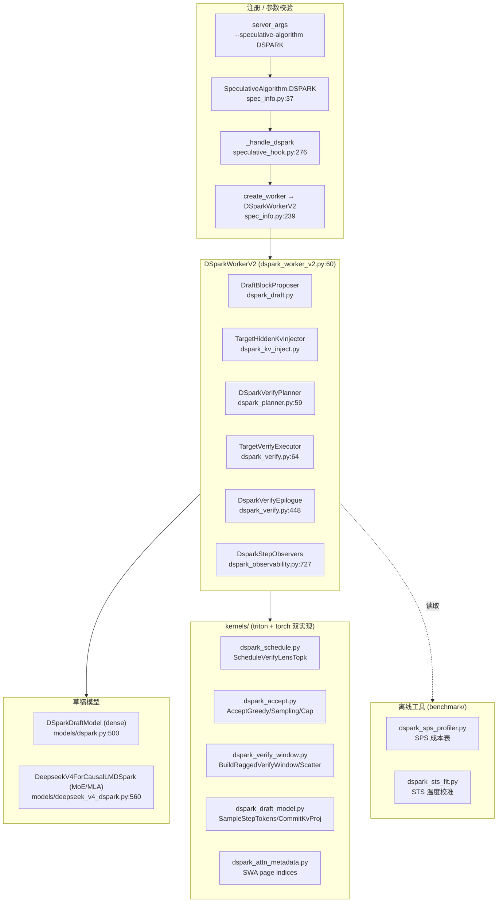
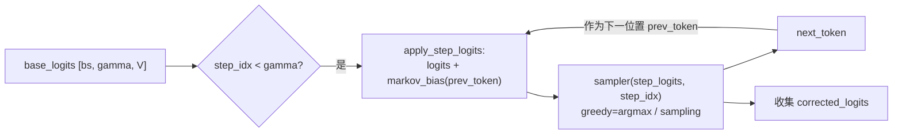
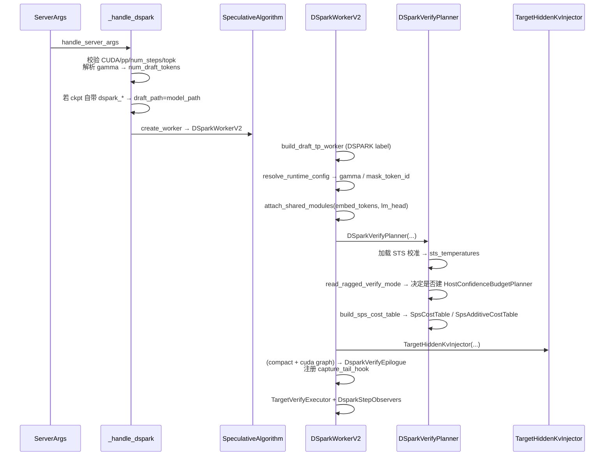
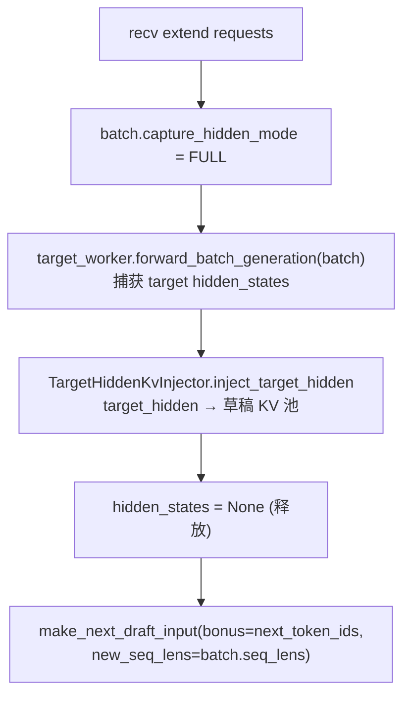
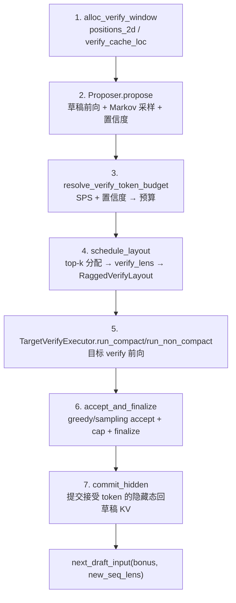
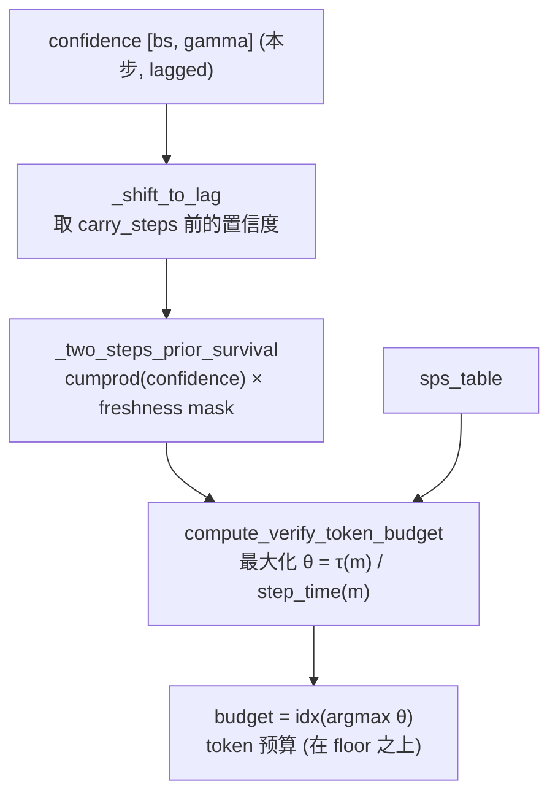
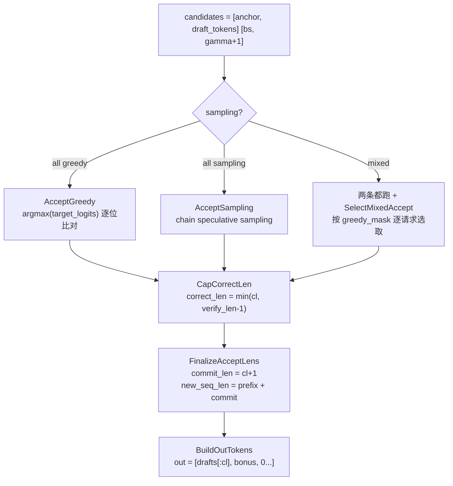
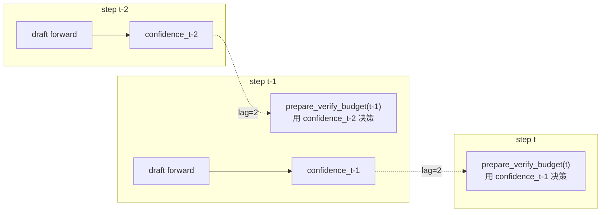
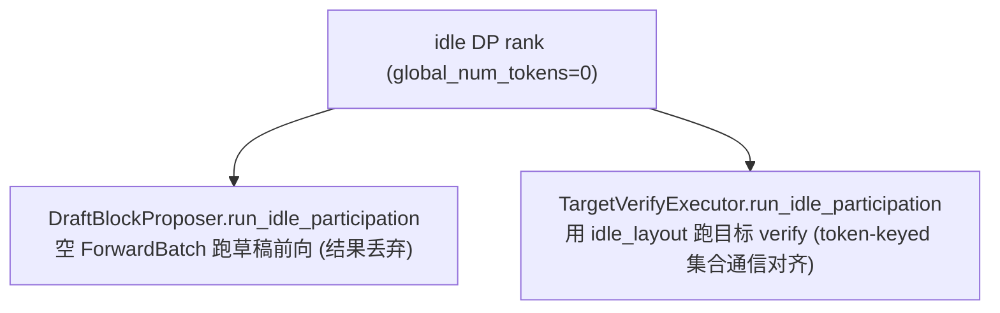
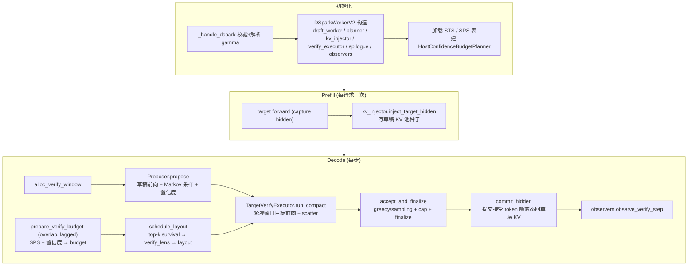

# SGLang DSpark 投机解码实现逻辑梳理

> 本文基于 SGLang 当前主干代码，梳理 **DSpark** 投机解码算法的设计动机、核心数据结构、Draft/Verify/Accept/Commit 全链路、置信度预算调度、Ragged（变长）Verify、与 DP-Attention 的集成，以及离线 Profiling/校准工具。所有结论均标注 `文件:行号`，便于对照源码。

DSpark 属于 DFlash 家族（`spec_info.py:118` `is_dflash_family`），同样采用「掩码块 + 目标隐藏态注入」的自投机范式，但在其上叠加了三层关键增强：**半自回归 Markov 草头**、**置信度驱动的变长 Verify 预算调度**、以及**面向 cuda graph 的紧凑（compact）变长 Verify**。

---

## 1. 设计动机

经典 MTP / DFlash 草稿在每个 decode step 提出固定 `gamma` 个草稿 token，目标模型一次性验证全部 `gamma+1` 个位置。问题：

- 草稿质量随位置衰减：靠后的草稿几乎必然被拒，验证它们纯属浪费算力。
- 所有请求共享同一个 verify 窗口长度，无法按「这个请求的草稿很靠谱、那个很烂」分别裁剪。
- 高 `gamma` 下 verify 的有效吞吐（tokens/sec）随 batch token 数变化，存在一个最优预算点，但静态窗口踩不中。

**DSpark 的核心思想**：

1. **半自回归草稿（Markov head）**：草稿骨干一次前向算出 `gamma` 个位置的隐藏态与 base logits（并行、非 AR）；再用一个轻量 **Markov head** 逐位置把「上一个采样 token」的 embedding 作为偏置加回 logits，再做采样。这样既保留了并行性，又恢复了 token 间条件依赖，提升长位置草稿命中率（`models/dspark.py:32-128`）。
2. **置信度头 + STS 校准**：一个线性头把草稿隐藏态（可拼接 markov embedding）映射为每个位置的「存活概率」`confidence ∈ [0,1]`，并用离线拟合的 per-position 温度做 sigmoid 校准（`models/dspark.py:287-328`，`dspark_planner.py:873-895`）。
3. **SPS 预算调度**：用一张离线 profiling 的「steps/sec ~ batch_tokens」成本表，在线求解「最大化 θ = 预期接受 token 数 / 单步耗时」的 verify token 预算（`dspark_planner.py:926-963`）。
4. **紧凑变长 Verify（compact ragged）**：把每个请求裁剪后的 `verify_len` 打包进一个固定 token 桶（cuda graph 友好），目标模型只验证「真正可能命中」的 token（`dspark_verify.py:352-420`）。

CLI 算法选择（`server_args.py:1664`）：

```
--speculative-algorithm DSPARK
--speculative-draft-model-path <draft ckpt>   # 或目标 ckpt 自带 dspark_* 字段时省略
--speculative-dspark-block-size <gamma>       # = num_draft_tokens - 1
```

约束（`speculative_hook.py:276-407`）：仅 CUDA、`pp_size==1`、`speculative_num_steps==1`、`speculative_eagle_topk==1`、`num_draft_tokens == gamma+1`；强制关闭 `mixed_chunk`；`max_running_requests` 默认调到 48。

---

## 2. 顶层架构与关键文件



### 文件职责一览

| 文件 | 行数 | 职责 |
|------|------|------|
| `dspark_worker_v2.py` | 693 | 主 Worker，编排 prefill / decode 全流程 |
| `dspark_planner.py` | 1117 | 预算规划、layout 调度、SPS/STS 加载、HostConfidenceBudgetPlanner |
| `dspark_verify.py` | 716 | 目标 verify 执行、accept/finalize、cuda graph epilogue |
| `dspark_draft.py` | 421 | 草稿前向、Markov 采样、folded sampler |
| `dspark_kv_inject.py` | 157 | 把目标隐藏态写回草稿 KV 池（dense / MLA 双路径） |
| `dspark_observability.py` | 961 | info dumper、置信度校准探针、block-accept 估计器门面 |
| `dspark_block_accept_estimator.py` | 835 | 在线「未截断接受长度」估计（跨步 pending 块追踪） |
| `dspark_sps.py` | 164 | SPS 成本表两种结构 + 序列化 |
| `dspark_sts.py` | 76 | STS 校准表 + 数据采集器 |
| `dspark_config.py` | 295 | 配置解析（gamma / markov / mask_token / 打包检测） |
| `kernels/dspark_schedule.py` | 260 | verify_len top-k 分配（Triton） |
| `kernels/dspark_accept.py` | 862 | greedy/sampling accept、cap、finalize、softmax-temp |
| `kernels/dspark_verify_window.py` | 871 | ragged 窗口构建、compact↔strided scatter、commit-inject layout |
| `kernels/dspark_draft_model.py` | 443 | step 采样、fused commit-kv 投影 |
| `kernels/dspark_attn_metadata.py` | 491 | DSV4 SWA 页索引与窗口 gather |
| `models/dspark.py` | 509 | dense 草稿：Markov 头族 + 置信度头 |
| `models/deepseek_v4_dspark.py` | 892 | MoE 草稿：DSV4 stage / MLA 草稿注意力 / V4 权重重映射 |

---

## 3. 核心概念与配置

### 3.1 gamma 与 verify 窗口

- `gamma`：草稿每步提出的 token 数（`dspark_config.py:16` `DEFAULT_DSPARK_GAMMA = 7`）。
- `verify_num_draft_tokens = gamma + 1`：目标 verify 窗口长度（含 bonus 位，`dspark_config.py:120-124`）。
- `speculative_num_draft_tokens` 必须等于 `gamma + 1`（`speculative_hook.py:372-388`）。

### 3.2 Markov 头（草头条件化）

三种实现（`models/dspark.py`，`SUPPORTED_DSPARK_MARKOV_HEAD_TYPES = ("vanilla","gated","rnn")`，`dspark_config.py:17`）：

| 类型 | 类 | 条件化方式 |
|------|----|-----------|
| `vanilla` | `VanillaMarkov` (`:65`) | `bias = markov_w2(markov_w1(prev_token))`，纯前 token embedding 投影 |
| `gated` | `GatedMarkovHead` (`:131`) | 在 vanilla 基础上对 `[hidden, prev_emb]` 做 sigmoid gate 调制 |
| `rnn` | `RNNHead` (`:162`) | 维护隐状态 `state`，GRU 式更新，长程依赖更强 |

关键接口 `sample_block`（`models/dspark.py:114-128`）逐位置调用 `apply_step_logits` + `sampler`：



> **半自回归**的含义：`base_logits` 由草稿骨干**一次并行**前向得到（非 AR 的算力开销）；Markov 头的逐位置采样是一个轻量的 Python 循环（`run_markov_block`，`models/dspark.py:32-62`），仅做 embedding lookup + 线性投影 + 采样，开销远小于完整 transformer 层。

### 3.3 置信度头与 STS

`DSparkConfidenceHead`（`models/dspark.py:287-328`）：

```python
confidence_raw = proj(cat[hidden, markov_embed_stack])  # [bs, gamma] 标量
confidence = sigmoid(confidence_raw / sts_temperatures)  # per-position 温度校准
```

- `sts_temperatures` 是长度 `gamma` 的向量，离线用 `dspark_sts_fit.py` 拟合（见 §9.2），运行时从 `--speculative-dspark-confidence-sts-path` 加载（`dspark_planner.py:83-112`）。
- `confidence[i]` 语义：在第 `i` 个位置，草稿 token 被目标接受的**条件存活概率**。累积乘积 `cumprod(confidence)` 即前 `k` 个位置全命中的联合概率（`dspark_planner.py:1085` `_two_steps_prior_survival`）。

### 3.4 SPS 成本表

两种结构（`dspark_sps.py`）：

- **`SpsCostTable`**（`:14`）：`(sample_batch_tokens, sample_steps_per_sec)` 离散探针，按 `batch_tokens` 查最近左端点的 steps/sec。
- **`SpsAdditiveCostTable`**（`:62`）：加性模型 `step_time = bias + alpha(num_reqs) + theta(num_reqs + budget)`，两维插值，更适合外推。

`build_uninitialized_sps_table`（`:153`）返回 flat 表（恒为 1 step/s），此时预算退化为 verify-all（`dspark_planner.py:191-198` 会告警）。

### 3.5 Ragged Verify 模式

`RaggedVerifyMode`（`ragged_verify.py:13-16`），由 `SGLANG_RAGGED_VERIFY_MODE` 控制：

| 模式 | 行为 | 是否需置信度头 | 是否需 SPS 表 |
|------|------|--------------|--------------|
| `static`（默认） | 所有请求 verify `gamma+1`，无裁剪 | 否（`build_confidence_head` 返回 None） | 否（no-op 告警） |
| `compact` | 按置信度分配 per-request `verify_len`，打包进 token 桶 | **是**（强制，`dspark_planner.py:127-137`） | 建议提供 |

`RaggedVerifyLayout`（`ragged_verify.py:46`）：`verify_lens[bs]` + `graph_num_tokens`（打包后的桶大小，须落在 cuda graph 捕获的 token 桶列表内）。

---

## 4. 初始化流程



关键点：

- **草稿注意力后端**：若草稿是 DeepSeek-V4（MoE），强制用 `DSV4_DRAFT_ATTENTION_BACKEND="dsv4"`（`dspark_config.py:21`，`dspark_worker_v2.py:111-114`）；dense 草稿走通用 draft backend。
- **共享模块**：草稿模型不自带 `embed_tokens` / `lm_head`，运行时从目标模型挂载（`dspark_worker_v2.py:152-161`，`attach_shared_modules`）。dense 草稿的 `compute_base_logits` 直接复用目标 `lm_head.weight`（`models/dspark.py:382-395`）。
- **cuda graph epilogue**：仅 compact + cuda graph + CUDA 时构造 `DsparkVerifyEpilogue`（`dspark_worker_v2.py:202-222`），把 accept/scatter/commit 折进目标 verify graph 的 tail hook。
- **DP-Attention 约束**：DSpark + DP + dense 草稿 + compact + cuda graph 不兼容（`dspark_worker_v2.py:172-184`）；DSpark + DP + MoE 草稿要求 `attn_tp==1`（`dspark_worker_v2.py:92-97`）。

---

## 5. Prefill：注入目标隐藏态

Prefill 阶段不投机，但要把目标模型算出的隐藏态写进草稿 KV 池，作为后续 decode 草稿的「上下文种子」。

`_forward_prefill`（`dspark_worker_v2.py:392-443`）：



注入路径（`dspark_kv_inject.py:31-103`）：

- **dense 路径**：`draft_model.write_target_hidden_kv` 逐层 `kv_proj_only` + `k_norm` + `apply_k_rope`，写 `pool.set_kv_buffer`（`models/dspark.py:461-497`）。
- **MLA 路径**（DSV4）：检测 `pool.set_swa_key_buffer_radix_fused_norm_rope`，走 `_inject_mla`，把 full cache_loc 翻译成 swa_loc，调用 `write_target_hidden_kv(main_hidden, swa_loc, ...)`（`dspark_kv_inject.py:80-103`，`models/deepseek_v4_dspark.py:654-678`）。

---

## 6. Decode 全流程（核心）

`_forward_decode`（`dspark_worker_v2.py:493-690`）是 DSpark 的主循环。一个 step 分七段：



### 6.1 草稿提议（Propose）

`DraftBlockProposer.propose`（`dspark_draft.py:244-312`）：

1. **构造草稿输入**（`_run_forward`，`:337-402`）：
   - `draft_block_ids[bs, gamma]`：首列为 anchor（上一步 bonus），其余为 `mask_token_id`（噪声占位）。
   - `draft_positions = seq_lens + [0..gamma-1]`，`draft_cache_loc` 复用 verify window 的前 gamma 列（`dspark_draft.py:356-357`）。
   - 若草稿无 `forward_embed`，用目标 `embed_tokens` 对 `draft_block_ids` 求 embedding 作为输入（`:361-363`）。
2. **草稿前向**：`draft_model_runner.forward(ForwardMode.TARGET_VERIFY)` 得 `raw_hidden [bs*gamma, H]`（`:390-391`）。
3. **base_logits + Markov 采样**：
   - **folded 路径**（cuda graph，greedy）：`DsparkDraftSampler` 已在 graph capture 时折进 tail hook，直接读 `sampler.out[:bs*gamma]`（`:271-290`，`dspark_draft.py:58-97`）。
   - **eager 路径**：`compute_base_logits(raw_hidden)` → `[bs, gamma, V]`，再 `sample_draft_block` 逐位置 Markov 采样（`:291-304`，`dspark_draft.py:156-214`）。
4. **置信度**：folded 时从 `sampler.confidence_out` 读；否则 `planner.compute_confidence_tensor`（`dspark_worker_v2.py:549-556`）。

> **folded** 意味着草稿采样 + 置信度计算被折进草稿 cuda graph，单步零 Python 开销；条件是 `gamma>0` 且草稿有 `compute_base_logits` + `markov_head`（`dspark_draft.py:119-134`）。

### 6.2 预算求解（Budget）

`HostConfidenceBudgetPlanner.compute_budget`（`dspark_planner.py:1019-1049`）：



`compute_verify_token_budget`（`:926-963`）：

- 候选：把所有 (request, position) 的存活概率降序排列，前 `budget` 个被选中验证。
- 目标函数：`τ_star = num_requests + cumsum(survival_sorted)`（预期接受 token 数），`θ = τ_star / step_time`。
  - `SpsCostTable`：`step_time = 1 / sps(m)`，`m = num_requests + budget_idx`。
  - `SpsAdditiveCostTable`：`step_time = bias + α(num_reqs) + θ(num_reqs+budget)`（`_additive_step_time_tensor`，`:976-992`）。
- 取 `argmax θ` 得预算 `idx`。

> **直觉**：预算越大，预期接受越多，但单步越慢；θ 是「每秒接受 token 数」。SPS 表刻画了「加更多 verify token 会让单步慢多少」的边际成本，最优预算在边际收益=边际成本处。

### 6.3 变长调度（Schedule Layout）

`DSparkVerifyPlanner.schedule_layout`（`dspark_planner.py:407-495`）：

1. `_schedule_verify_lens`（`:550-590`）调用 `ScheduleVerifyLensTopk.execute`：
   - 计算 `survival = cumprod(confidence)`。
   - 在 `[bs, max_len]` 候选窗口内，按 survival 降序选 `budget` 个 (req, pos)。
   - 每个 request 的 `verify_len = min_verify_len + selected_extra`，clamp 到 `[min, max]`（`kernels/dspark_schedule.py:64-115`）。
   - Triton 实现（`:212-260`）用三段 kernel：prep（cumprod）→ selected_extra（atomic top-k 排序）→ finalize（clamp）。
2. 跨 TP rank 广播 `verify_lens`（`verify_lens_broadcast_group`，`:742-745`）：DP-Attention 下用 attn_tp 组，否则用全局 tp 组。
3. 构造 `RaggedVerifyLayout`：`graph_num_tokens = round_up(total, capture_bucket)`（`:478-495`），确保落在 cuda graph 捕获的 token 桶内。

### 6.4 目标 Verify

两条路径（`dspark_worker_v2.py:593-613`）：

- **compact**（`run_compact`，`dspark_verify.py:352-420`）：
  1. `BuildRaggedVerifyWindow`（`kernels/dspark_verify_window.py:20`）：把 per-request 的 `(anchor, draft_tokens)` 按各自 `verify_len` 打包成紧凑的 `verify_ids[graph_num_tokens]`，并算出对应 `positions` / `verify_cache_loc`（用 `compact_row_index` 做前缀和二分搜索，`:321-396`）。
  2. `DsparkVerifyEpilogue.begin_step(verify_lens, armed)`：把本步 verify_lens 拷进 graph buffer（`:506-514`）。
  3. `_run_ragged`：目标模型对紧凑窗口前向，输出 `compact_logits / compact_hidden [graph_num_tokens, ...]`。
  4. **Scatter 回 strided**：`ScatterCompactToStrided` 把紧凑结果按 `verify_lens` 散开成 `[bs, gamma+1, ...]`（带 fill_value padding），供逐请求 accept（`kernels/dspark_verify_window.py:452-595`）。cuda graph 路径下这一步由 epilogue 在 graph 内完成（`dspark_verify.py:385-393`）。
- **non-compact**（`run_non_compact`，`dspark_verify.py:210-255`）：所有请求 verify 全长 `gamma+1`，等价于 DFlash 的标准 verify。

### 6.5 Accept / Finalize

`accept_and_finalize`（`dspark_verify.py:86-144`）：



- **CapCorrectLen**（`kernels/dspark_accept.py:782-862`）：`correct_len` 不得超过 `verify_len - 1`（被裁掉的 token 不算接受）；超出部分记入 `cap_trim_lens`。
- **folded accept**：cuda graph 下 accept/scatter/finalize 全在 `DsparkVerifyEpilogue.__call__` 内（`dspark_verify.py:553-624`），worker 只需 `read_accept(bs)` 读 buffer。
- **混合采样**：批内既有 greedy 又有 sampling 请求时，两套 accept kernel 都跑，再用 `SelectMixedAccept` 按 `greedy_mask` 逐行选（`kernels/dspark_accept.py:414-553`）。

### 6.6 Commit Hidden

`commit_hidden`（`dspark_verify.py:282-313`）把**被接受 token** 对应的目标隐藏态写回草稿 KV 池，作为下一步草稿的上下文：

- compact 路径：`kv_injector.inject_ragged(hidden_strided, commit_lens)`（`dspark_kv_inject.py:105-157`）。
- non-compact：`inject_target_hidden(hidden, commit_lens)`，`commit_lens` 决定写多少列（`:31-78`）。
- MLA 路径下，`commit_lens` 用于把未提交列的 `swa_loc` 置 -1（`dspark_kv_inject.py:91-95`），避免污染 SWA buffer。
- **folded commit**：当 `folds_commit`（pool 支持 `set_swa_key_buffer_radix_fused_norm_rope`）时，commit 也折进 epilogue 的 graph（`dspark_verify.py:568-571, 626-650`），用 `BuildCommitInjectLayout` 算 swa_loc（`kernels/dspark_verify_window.py:603-759`）。

---

## 7. Overlap 调度：置信度中继环

Overlap 模式下，本步的草稿前向与上一步的目标 verify 交叠。问题：**预算决策发生在 `prepare_verify_budget`（草稿前向之前），但置信度要等草稿前向完才知道**。

解法：**置信度中继环（confidence relay ring）**（`overlap_utils.py:118-119`）：



- `CONFIDENCE_RELAY_RING_LAG = 2`（`overlap_utils.py:118`），`SGLANG_DSPARK_CONFIDENCE_RELAY_LAG_STEPS` 默认 2（`dspark_planner.py:1012`）。
- `HostConfidenceBudgetPlanner._shift_to_lag`（`:1059-1076`）：用 `carry_steps` 个环形 slot 缓存历史置信度，返回 `lag_steps` 前的置信度。
- `_two_steps_prior_survival`（`:1078-1090`）：累积乘积 × 新鲜度 mask（`generation` 匹配才用历史，否则置 1，避免跨请求串味）。
- 调用点：scheduler 在 overlap 路径的 `prepare_forward_inputs` 阶段调 `self._confidence_budget_prepare(batch, future_map)`（`scheduler.py:1258-1271, 3258-3259`），把预算提前写进 `draft_input.verify_token_budget`。

`prepare_verify_budget`（`dspark_planner.py:283-311`）：从 `future_map.resolve_confidence_cpu(batch)` 拿到 lagged 置信度 → 算预算 → 写 `draft_input.verify_token_budget` 和 `batch.spec_verify_tier_num_tokens`。

> **静态模式（`SGLANG_RAGGED_VERIFY_MODE=static`）不启用中继**（`overlap_utils.py:51-57` `decide_needs_confidence_relay` 返回 False），因为没有置信度头，预算恒为 verify-all。

---

## 8. 与 DP-Attention 的集成

DSpark 是少数支持 DP-Attention 的投机算法（`speculative_hook.py:281-303`）。核心难点：**MoE 草稿 + DP 下，草稿的 MoE all-reduce 必须在 attn_tp 组内完成**（`dspark_worker_v2.py:92-97`）。

### 8.1 DP-aware 的 verify tier 同步

`_maybe_gather_dp_verify_tier`（`dspark_planner.py:313-329`）：compact 模式下，各 DP rank 的 `spec_verify_tier_num_tokens` 通过 `all_gather_into_tensor` 同步（CPU group），取 max 作为全局 tier（`dp_global_verify_tier_num_tokens`，`:655-664`）。这保证所有 DP rank 用同一个 `graph_num_tokens` 桶，MoE TP 通信对称。

启用条件（`dspark_planner.py:159-170`）：compact + DP + `attn_tp_size==1` + `attn_cp_size==1` + 需要 MLP TP gather + 非 overlap-skip + 非 disagg + `pp_size==1`。

### 8.2 Idle DP rank 参与

某些 DP rank 无请求时，MoE TP 通信仍要求所有 rank 参与。`run_idle_participation`（草稿侧 `dspark_draft.py:314-335`，目标侧 `dspark_verify.py:160-208`）构造空 batch 跑通通信：



`_idle_verify_ragged_layout`（`dspark_worker_v2.py:445-457`）用全局 max bs 构造一个 `[1]*tier_num_reqs` 的 uniform layout，确保 idle rank 也按相同 token 桶加入集合通信。

### 8.3 dense 草稿的 attn-TP 局部上下文

dense 草稿（非 MoE）在 DP 下用 `draft_tp_context(attn_tp_group)` 限定通信域（`dspark_worker_v2.py:293-296`，`dspark_draft.py:239-242`），草稿 attention 在 attn_tp 组内 TP，不跨 DP。

---

## 9. 可观测性与离线工具

### 9.1 在线可观测（`dspark_observability.py`）

`DsparkStepObservers`（`:727`）是门面，聚合四个 sink：

| Sink | 触发环境变量 | 产出 |
|------|------------|------|
| `DsparkInfoDumper` | `SGLANG_DSPARK_DEBUG_DUMP=<tokens>` | 每步 JSON 记录（bs/budget/verify_tokens/各段 GPU 耗时/每请求 detail） |
| `ConfidenceMetricsProbe` | `SGLANG_DSPARK_DEBUG_CONFIDENCE_METRICS=1` | per-position 校准表（ECE/AUC/Brier/reliability） |
| `BlockAcceptEstimateRecorder` | `SGLANG_DSPARK_BLOCK_ACCEPT_ESTIMATE_PATH` | 在线「未截断接受长度」估计 |
| `StsDataRecorder` | `SGLANG_DSPARK_STS_COLLECT_PATH` | 收集 (logits, prefix_mask) 供 STS 离线拟合 |

`InfoComponent`（`:35-42`）token：`core, step_cpu_time, step_gpu_time, draft_gpu_time, target_verify_gpu_time, reqs, all`。仅在 `attn_tp_rank==0` 上启用，但 DP 下每个 DP rank 都 dump（`dspark_observability.py:185-188`）。

**SPS 预测校验**（`dspark_observability.py:374-411`）：`SGLANG_DSPARK_LOG_SPS_PRED_INTERVAL=N` 时，每 N 步对比预算器预测的 `predicted_step_ms` 与实测 `step_gpu_ms`，输出 MAE / 相对误差 / bias / mismatch 率。

**运行时控制**：scheduler 暴露 `dspark_force_budget_frac` / `dspark_clear_info_records` 两个动态参数（`scheduler.py:3823-3905`），可经 update-server-args 在线调预算比例或清空记录。

### 9.2 STS 离线拟合（`benchmark/dspark_sts_fit.py`）

流程：
1. 运行时 `SGLANG_DSPARK_STS_COLLECT_PATH=/path/stem` 收集 `(confidence_raw, num_correct_drafts)` 分片（`dspark_sts.py:39-76`）。
2. 离线 `python -m sglang.benchmark.dspark_sts_fit --shards '/path/stem.*.pt' --out sts.json`：对每个 position 在温度网格 `logspace(0.1, 10, 41)` 上最小化 ECE（`dspark_sts_fit.py:48-111`），输出 `DSparkStsCalibration.temperatures`。
3. 运行时 `--speculative-dspark-confidence-sts-path sts.json` 加载（`dspark_planner.py:83-112`）。

> 采集时要求 identity 温度（未校准），否则报错（`dspark_planner.py:89-97`）——必须先采集再校准，不能叠校准。

### 9.3 SPS 离线 profiling（`benchmark/dspark_sps_profiler.py`）

`python -m sglang.benchmark.dspark_sps_profiler run ...` + `fit`：
1. **run**：对一组 `(num_reqs, budget_frac)` 扫描，每轮发请求并读 `/dspark_info_record`（`dspark_observability.dump`），记录每步的 `num_verify_tokens` 与 `step_gpu_ms`（`:166-340`）。
2. **fit**：把 `(num_reqs, m=num_reqs+budget, step_time)` 拟合成 `SpsAdditiveCostTable`（加性模型，`build_additive_table_from_cells`，`:1146-1162`；OLS 残差 backfit，`:1163-1214`）。
3. 输出 JSON，运行时 `--speculative-dspark-sps-table-path sps.json` 加载。

### 9.4 Block-Accept 估计器（`dspark_block_accept_estimator.py`）

`SGLANG_DSPARK_BLOCK_ACCEPT_ESTIMATE_PATH` 启用。它追踪**未截断**（即假设 verify_len=gamma+1）下的接受长度，用于评估 compact 裁剪的潜在收益。

核心机制（`:174-218`）：每个请求维护 `_PendingBlock` 队列——当某步 `correct_len == verify_len-1 < gamma`（命中截断边界），把剩余 draft token 存为 pending block；下一步目标 verify 后，用目标的 logits 重新评估这些 pending token 的接受概率（`_settle_pending`，`:689-732`），累积成「如果当时没截断能接受多长」的估计。在线滑窗输出 `[lo, hi]` 区间（`_OnlineCeiling`，`:100-171`）。

---

## 10. 配置项汇总

### 10.1 CLI 参数（`server_args.py:1700+`）

| 参数 | 默认 | 说明 |
|------|------|------|
| `--speculative-dspark-block-size` | 自动 | gamma（草稿 token 数）；省略则从 draft ckpt `block_size` 推断，再省略用 `DEFAULT_DSPARK_GAMMA=7` |
| `--speculative-dspark-sps-table-path` | None | SPS 成本表 JSON（compact 模式必填，否则 verify-all） |
| `--speculative-dspark-confidence-sts-path` | None | STS 温度校准 JSON |
| `--speculative-dspark-align-verify-tokens-to-graph-tier` | False | compact 专属：把预算对齐到 cuda graph 桶上界，吃满 padding（`dspark_planner.py:497-548`） |

### 10.2 环境变量（`environ.py:266-284, 723-725`）

| 变量 | 默认 | 说明 |
|------|------|------|
| `SGLANG_RAGGED_VERIFY_MODE` | `static` | `static` / `compact`，决定是否变长 verify |
| `SGLANG_DSPARK_CONFIDENCE_RELAY_LAG_STEPS` | 2 | 置信度中继环 lag（overlap 下生效） |
| `SGLANG_PREP_IN_CUDA_GRAPH` | False | compact 模式**强制**开启（`dspark_planner.py:200-208`），否则 verify_lens 的 host 读在关键路径 |
| `SGLANG_DSPARK_FAST_KERNEL` | True | DSV4 草稿注意力用 fused q-norm-rope kernel |
| `SGLANG_DSPARK_FAST_SAMPLING` | True | 采样用 `exponential_` + argmax（Gumbel-max）而非 softmax+multinomial |
| `SGLANG_DSPARK_FP32_LM_HEAD` | False | dense 草稿 lm_head 用 fp32 |
| `SGLANG_DSPARK_OPT_MARKOV_W2_BF16` | True | markov_w2 用 bf16 而非 fp32 |
| `SGLANG_DSPARK_OPT_MARKOV_W2_TP_SHARD` | True | markov_w2 按 lm_head 分片 + attn_tp all-gather（`models/deepseek_v4_dspark.py:376-393`） |
| `SGLANG_DSPARK_ENABLE_MULTI_STREAM` | True | DSV4 草稿 Q/KV 双流重叠 |
| `SGLANG_SIMULATE_ACC_LEN` | -1 | 测试用：模拟固定接受长度（>0 时要求 verify-all 模式，`dspark_worker_v2.py:224-241`） |
| `SGLANG_DSPARK_DEBUG_DUMP` | () | info dumper token（`core,reqs,step_gpu_time,...,all`） |
| `SGLANG_DSPARK_ENABLE_SPS_RECORD` | False | 等价 `DEBUG_DUMP=core,step_cpu_time`（SPS profiler 用） |
| `SGLANG_DSPARK_LOG_SPS_PRED_INTERVAL` | 0 | 每 N 步打印 SPS 预测 vs 实测 |
| `SGLANG_DSPARK_DEBUG_CONFIDENCE_METRICS` | False | per-position 校准表 |
| `SGLANG_DSPARK_DEBUG_CONFIDENCE_PREFIX_SCHEDULER` | False | 打印每步 verify_len 决策明细 |
| `SGLANG_DSPARK_STS_COLLECT_PATH` | "" | STS 数据采集路径 |
| `SGLANG_DSPARK_BLOCK_ACCEPT_ESTIMATE_PATH` | "" | block-accept 估计输出路径 |
| `SGLANG_DSPARK_BLOCK_ACCEPT_ONLINE_INTERVAL` | 0 | 在线估计打印间隔 |
| `SGLANG_TEST_RAGGED_VERIFY_FORCE_UNIFORM_CAPTURE` | False | 测试：强制 uniform cuda graph 捕获 |

---

## 11. 一图总览



---

## 12. 关键文件索引

| 主题 | 文件 | 关键符号 |
|------|------|----------|
| 算法注册 / Worker 工厂 | `python/sglang/srt/speculative/spec_info.py` | `SpeculativeAlgorithm.DSPARK`, `is_dspark`, `supports_ragged_verify`, `create_worker` |
| 参数校验 | `python/sglang/srt/arg_groups/speculative_hook.py` | `_handle_dspark`, `_target_checkpoint_bundles_dspark_draft` |
| 主 Worker | `python/sglang/srt/speculative/dspark_components/dspark_worker_v2.py` | `DSparkWorkerV2`, `_forward_prefill`, `_forward_decode` |
| 预算规划 | `python/sglang/srt/speculative/dspark_components/dspark_planner.py` | `DSparkVerifyPlanner`, `HostConfidenceBudgetPlanner`, `compute_verify_token_budget`, `schedule_layout` |
| 目标 verify / accept | `python/sglang/srt/speculative/dspark_components/dspark_verify.py` | `TargetVerifyExecutor`, `DsparkVerifyEpilogue`, `accept_draft_tokens` |
| 草稿提议 | `python/sglang/srt/speculative/dspark_components/dspark_draft.py` | `DraftBlockProposer`, `DsparkDraftSampler`, `sample_draft_block` |
| KV 注入 | `python/sglang/srt/speculative/dspark_components/dspark_kv_inject.py` | `TargetHiddenKvInjector` |
| SPS 成本表 | `python/sglang/srt/speculative/dspark_components/dspark_sps.py` | `SpsCostTable`, `SpsAdditiveCostTable` |
| STS 校准 | `python/sglang/srt/speculative/dspark_components/dspark_sts.py` | `DSparkStsCalibration`, `StsDataRecorder` |
| 可观测门面 | `python/sglang/srt/speculative/dspark_components/dspark_observability.py` | `DsparkStepObservers`, `DsparkInfoDumper`, `ConfidenceMetricsProbe` |
| Block-accept 估计 | `python/sglang/srt/speculative/dspark_components/dspark_block_accept_estimator.py` | `BlockAcceptEstimateRecorder` |
| 配置解析 | `python/sglang/srt/speculative/dspark_components/dspark_config.py` | `DSparkDraftConfig`, `resolve_runtime_config`, `checkpoint_bundles_dspark_draft` |
| dense 草稿模型 | `python/sglang/srt/models/dspark.py` | `VanillaMarkov`, `GatedMarkovHead`, `RNNHead`, `DSparkConfidenceHead`, `DSparkDraftModel` |
| MoE 草稿模型 | `python/sglang/srt/models/deepseek_v4_dspark.py` | `DSparkAttention`, `DSparkV4MarkovHead`, `DSparkV4Stage`, `DeepseekV4ForCausalLMDSpark` |
| verify_len 调度 kernel | `python/sglang/srt/speculative/dspark_components/kernels/dspark_schedule.py` | `ScheduleVerifyLensTopk`, `compute_sort_survival` |
| accept kernel | `python/sglang/srt/speculative/dspark_components/kernels/dspark_accept.py` | `AcceptGreedy`, `AcceptSampling`, `CapCorrectLen`, `FinalizeAcceptLens`, `SoftmaxTemp` |
| ragged 窗口 kernel | `python/sglang/srt/speculative/dspark_components/kernels/dspark_verify_window.py` | `BuildRaggedVerifyWindow`, `ScatterCompactToStrided`, `BuildCommitInjectLayout`, `BuildOutTokens` |
| 草稿采样 kernel | `python/sglang/srt/speculative/dspark_components/kernels/dspark_draft_model.py` | `SampleStepTokens`, `CommitKvProj`, `BuildStepLocal` |
| DSV4 草稿注意力 | `python/sglang/srt/speculative/dspark_components/kernels/dspark_attn_metadata.py` | `ComputeDsparkWindowGather`, `BuildDsparkSwaPageIndices` |
| Ragged 模式 / Layout | `python/sglang/srt/speculative/ragged_verify.py` | `RaggedVerifyMode`, `RaggedVerifyLayout`, `read_ragged_verify_mode` |
| 置信度中继环 | `python/sglang/srt/managers/overlap_utils.py` | `CONFIDENCE_RELAY_RING_LAG`, `ResolvedConfidence`, `FutureMap.resolve_confidence_cpu`, `decide_needs_confidence_relay` |
| cuda graph token 桶 | `python/sglang/srt/model_executor/runner/decode_cuda_graph_runner.py` | `ragged_verify_compact_graphs_enabled`, `_build_ragged_verify_token_buckets`, `_capture_ragged_verify_layout` |
| 离线 SPS profiling | `python/sglang/benchmark/dspark_sps_profiler.py` | `run_profile`, `fit_profile`, `build_additive_table_from_cells` |
| 离线 STS 拟合 | `python/sglang/benchmark/dspark_sts_fit.py` | `fit_sts_temperatures`, `expected_calibration_error` |

---

### 附：常用启动配置示例

```bash
# 1. 最简：static 模式（无置信度，等价于带 Markov 头的 DFlash）
python -m sglang.launch_server \
  --model <target> --speculative-algorithm DSPARK \
  --speculative-draft-model-path <draft> \
  --speculative-dspark-block-size 7
# → speculative_num_draft_tokens 自动设为 8

# 2. compact 变长 verify（需 SPS 表 + STS 校准）
SGLANG_RAGGED_VERIFY_MODE=compact \
SGLANG_PREP_IN_CUDA_GRAPH=1 \
python -m sglang.launch_server \
  --model <target> --speculative-algorithm DSPARK \
  --speculative-draft-model-path <draft> \
  --speculative-dspark-block-size 7 \
  --speculative-dspark-sps-table-path sps.json \
  --speculative-dspark-confidence-sts-path sts.json

# 3. DSV4 自投机（draft 打包在 target ckpt，dspark_* 字段）+ DP-Attention
SGLANG_RAGGED_VERIFY_MODE=compact \
SGLANG_PREP_IN_CUDA_GRAPH=1 \
python -m sglang.launch_server \
  --model <dsv4-with-dspark-head> \
  --speculative-algorithm DSPARK \
  --tp 8 --dp 8 --enable-dp-attention --enable-dp-lm-head \
  --speculative-dspark-sps-table-path sps.json \
  --speculative-dspark-confidence-sts-path sts.json
```

### 附：离线工具链

```bash
# STS：先采集再拟合
SGLANG_DSPARK_STS_COLLECT_PATH=/data/stem python -m sglang.launch_server ...   # 跑代表性负载
python -m sglang.benchmark.dspark_sts_fit --shards '/data/stem.*.pt' --out sts.json

# SPS：profile + fit
python -m sglang.benchmark.dspark_sps_profiler run --base-url http://... --out /data/sps
python -m sglang.benchmark.dspark_sps_profiler fit --rounds /data/sps --out sps.json
```
